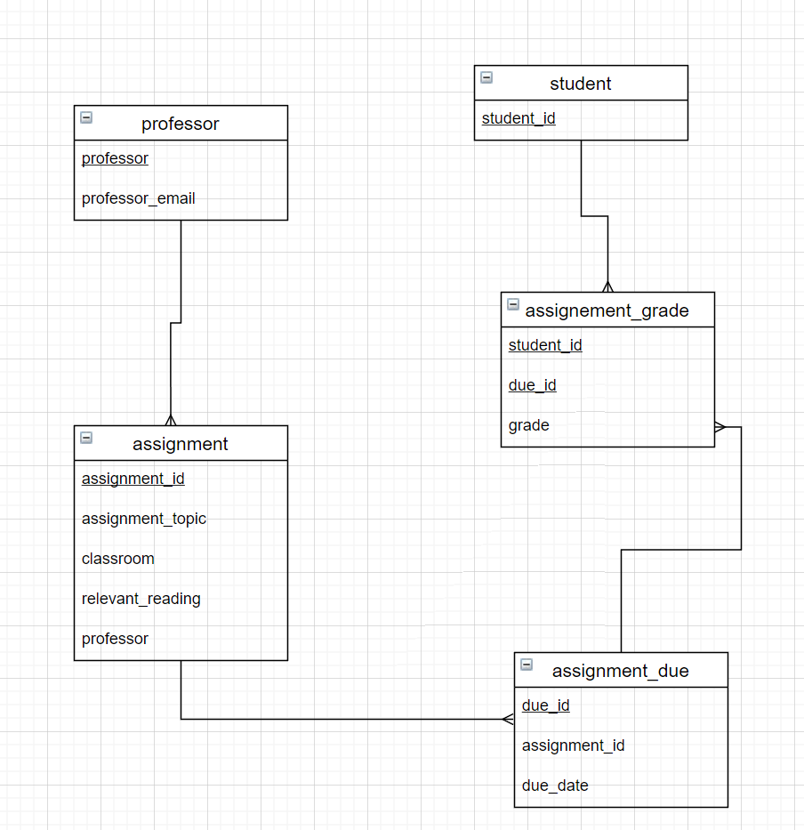

## Convert to 4NF

| assignment_id | student_id | due_date | professor | assignment_topic                | classroom | grade | relevant_reading    | professor_email   |
| :------------ | :--------- | :------- | :-------- | :------------------------------ | :-------- | :---- | :------------------ | :---------------- |
| 1             | 1          | 23.02.21 | Melvin    | Data normalization              | WWH 101   | 80    | Deumlich Chapter 3  | l.melvin@foo.edu  |
| 2             | 7          | 18.11.21 | Logston   | Single table queries            | 60FA 314  | 25    | Dümmlers Chapter 11 | e.logston@foo.edu |
| 1             | 4          | 23.02.21 | Melvin    | Data normalization              | WWH 101   | 75    | Deumlich Chapter 3  | l.melvin@foo.edu  |
| 5             | 2          | 05.05.21 | Logston   | Python and pandas               | 60FA 314  | 92    | Dümmlers Chapter 14 | e.logston@foo.edu |
| 4             | 2          | 04.07.21 | Nevarez   | Spreadsheet aggregate functions | WWH 201   | 65    | Zehnder Page 87     | i.nevarez@foo.edu |
| ...           | ...        | ...      | ...       | ...                             | ...       | ...   | ...                 | ...               |

The candidate key of the relation is (assignment_id, student_id, due_date)

### Convert to 2 NF

remove partial functional dependencies then become:

| assignment_id | assignment_topic                | due_date | classroom | relevant_reading    | professor | professor_email   |
| ------------- | ------------------------------- | :------: | --------- | ------------------- | --------- | ----------------- |
| 1             | Data normalization              | 23.02.21 | WWH 101   | Deumlich Chapter 3  | Melvin    | l.melvin@foo.edu  |
| 2             | Single table queries            | 18.11.21 | 60FA 314  | Dümmlers Chapter 11 | Logston   | e.logston@foo.edu |
| 4             | Spreadsheet aggregate functions | 04.07.21 | WWH 201   | Zehnder Page 87     | Nevarez   | i.nevarez@foo.edu |
| 5             | Python and pandas               | 05.05.21 | 60FA 314  | Dümmlers Chapter 14 | Logston   | e.logston@foo.edu |

| student_id | assignment_id | grade |
| ---------- | :-----------: | ----- |
| 1          |       1       | 80    |
| 2          |       4       | 65    |
| 2          |       5       | 92    |
| 4          |       1       | 75    |
| 7          |       2       | 25    |

### Convert to 3 NF

for there's transitive functional dependency professor->professor_email, so remove it then the relations become：

student table:

| student_id |
| ---------- |
| 1          |
| 2          |
| 4          |
| 7          |

professor table:

| professor | professor_email   |
| --------- | ----------------- |
| Melvin    | l.melvin@foo.edu  |
| Logston   | e.logston@foo.edu |
| Nevarez   | i.nevarez@foo.edu |

assignment table:

| assignment_id | assignment_topic                | due_date | classroom | relevant_reading    | professor |
| ------------- | ------------------------------- | :------: | --------- | ------------------- | --------- |
| 1             | Data normalization              | 23.02.21 | WWH 101   | Deumlich Chapter 3  | Melvin    |
| 2             | Single table queries            | 18.11.21 | 60FA 314  | Dümmlers Chapter 11 | Logston   |
| 4             | Spreadsheet aggregate functions | 04.07.21 | WWH 201   | Zehnder Page 87     | Nevarez   |
| 5             | Python and pandas               | 05.05.21 | 60FA 314  | Dümmlers Chapter 14 | Logston   |

student assignment grade table:

| student_id | assignment_id | grade |
| ---------- | :-----------: | ----- |
| 1          |       1       | 80    |
| 2          |       4       | 65    |
| 2          |       5       | 92    |
| 4          |       1       | 75    |
| 7          |       2       | 25    |

### Convert to 4 NF

student relation:

| student_id |
| ---------- |
| 1          |
| 2          |
| 4          |
| 7          |

professor table:

| professor | professor_email   |
| --------- | ----------------- |
| Melvin    | l.melvin@foo.edu  |
| Logston   | e.logston@foo.edu |
| Nevarez   | i.nevarez@foo.edu |

assignment table:

| assignment_id | assignment_topic                | classroom | relevant_reading    | professor |
| ------------- | ------------------------------- | --------- | ------------------- | --------- |
| 1             | Data normalization              | WWH 101   | Deumlich Chapter 3  | Melvin    |
| 2             | Single table queries            | 60FA 314  | Dümmlers Chapter 11 | Logston   |
| 4             | Spreadsheet aggregate functions | WWH 201   | Zehnder Page 87     | Nevarez   |
| 5             | Python and pandas               | 60FA 314  | Dümmlers Chapter 14 | Logston   |

For a professor might give the same assignment to different sections of the same course, but with different due dates, so an assignment may have more than one due date.

assignment with due table:

| assignment_due_id | assignment_id | due_date |
| ----------------- | ------------- | :------: |
| 1                 | 1             | 23.02.21 |
| 2                 | 2             | 18.11.21 |
| 4                 | 4             | 04.07.21 |
| 5                 | 5             | 05.05.21 |

student with assignment grade table:

| student_id | assignment_due_id | grade |
| ---------- | :---------------: | ----- |
| 1          |         1         | 80    |
| 2          |         4         | 65    |
| 2          |         5         | 92    |
| 4          |         1         | 75    |
| 7          |         2         | 25    |

## ER diagram

