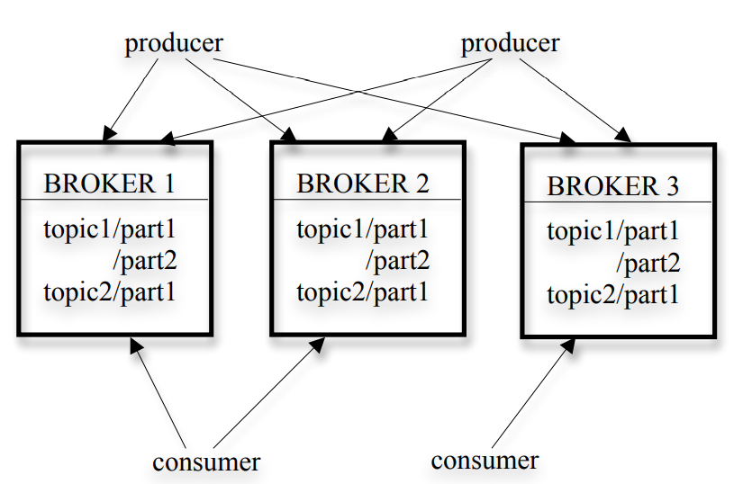
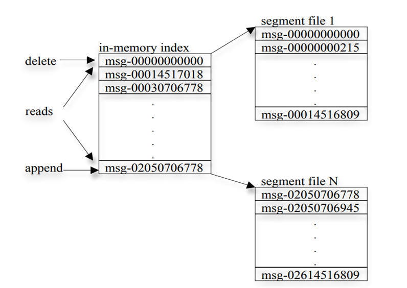
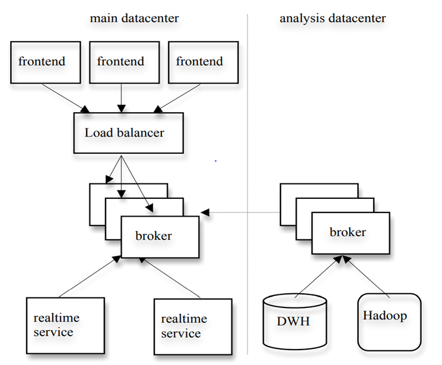

## Introduction of Kafka

Kafka is a distributed messaging system that is used to collect and deliver high volumes of log data with low latency. The paper's system introduces the architecture of Kafka and design principles of Kafka as well as Kafka usage. As a distributed messaging system which incorporates ideas from existing log aggregators and messaging systems such as IBM WebSphere MQ, and is suitable for both offline and online message consumption. The paper's  system made quite a few practical design choice in Kafka and justify the system is more efficient and scalable.

There is a large amount of “log” data generated at any sizable internet company.  Such as  (1) user activity  events corresponding to logins, pageviews, clicks, “likes”,  sharing, comments, and search queries; (2) operational metrics  such as service call stack, call latency, errors, and system metrics  such as CPU, memory, network, or disk utilization on each  machine. 

Here‘s some common usage of Kafka in production.

- #### Messaging

  Kafka can be used as a message broker among services. For example, If you are implementing a microservice architecture, you can have a microservice as a producer and another as a consumer. For instance, you have a microservice that is responsible to create new accounts and other for sending email to users about account creation.

- #### Activity Monitoring

  Kafka can be used for activity monitoring. The activity could belong to a website or physical sensors and devices. Producers can publish raw data from data sources that later can be used to find trends and pattern.

- #### Log Aggregation

  Kafka can be used to collect logs from different systems and store in a centralized system for further processing.

- #### Extract Transform and Load (ETL)

  Kafka has a feature of almost real-time streaming thus you can come up with an ETL based on your need.

- #### Database

  Kafka can also acts as a database. It is not a typical databases that have a feature of querying the data as per need, but you can keep data in Kafka as long as you want without consuming it (Message queing).

  

In real internet, real-time usage of social websites such as FaceBook， LinkedIn and ... The real-time log data makes new big challenges for messaging systems, it has faster  and lager characteristics, which generate log records dozens of items on each page which a user had just open or clicked. Every day, China Mobile collects 5–8TB of phone  call records and Facebook gathers almost 6TB of various user  activity events. Kafka combines the benefits of traditional log  aggregators and messaging systems. 

## Kafka Architecture 

The architecture of Kafka has several terms to understand, they are: topics, producers, consumers, brokers. The following are their general description.

#### Topics

Every message that is feed into the system must be part of some *topic*. The topic is nothing but a stream of records. The messages are stored in *key-value* format. Each message is assigned a sequence, called *Offset*. The output of one message could be an input of the other for further processing.

#### Producers

*Producers* are the applications responsible to publish data into Kafka system. They publish data on the *topic* of their choice.

#### Consumers

The messages published into *topics* are then utilized by *Consumer* applications. A *consumer* gets subscribed to the *topic* of its choice and consumes data.

#### Brokers

Every instance of Kafka that is responsible for message exchange is called a *Broker*. Kafka can be used as a stand-alone machine or a part of a cluster.



In short, A stream of messages of a particular type is defined by a topic. A producer can publish messages to a topic. The published messages are then stored at a set of servers called brokers.  A consumer can subscribe to one or more topics from the  brokers, and consume the subscribed messages by pulling data  from the brokers.

Since  Kafka is distributed in nature, an Kafka cluster typically consists  of multiple brokers. To balance load, a topic is divided into  multiple partitions and each broker stores one or more of those  partitions. Multiple producers and consumers can publish and  retrieve messages at the same time. 

### Efficiency on a Single Partition

Apart from the terms of Kafka, there's also other important characteristics.

(1) Kafka use simple storage

Kafka has a very simple storage layout. Each partition of a topic corresponds to a logical log. A log is implemented as a set of segment files of approximately the same size. Every time a producer publishes a message to a partition, the broker simply appends the message to the last segment file.
Unlike typical messaging systems, a message stored in Kafka doesn’t have an explicit message id. Instead, each message is addressed by its logical offset in the log. This avoids the overhead of maintaining auxiliary, seek-intensive random-access index structures that map the message ids to the actual message locations.
A consumer always consumes messages from a particular partition sequentially. If the consumer acknowledges a particular message offset, it implies that the consumer has received all messages prior to that offset in the partition. Under the covers, the consumer is issuing asynchronous pull requests to the broker to have a buffer of data ready for the application to consume. Each pull request contains the offset of the message from which the consumption begins and an acceptable number of bytes to fetch. 



From the picture above, every consumes a data record then the data will be deleted from broker, and every a new data record is produced by producer it will be appended the offset of last send out.

(2) Kafka ensure efficient transfer:
Kafka relies on the underlying file system page cache. This has the main benefit of avoiding double buffering---messages are only cached in the page cache. This has the additional benefit of retaining  warm cache even when a broker process is restarted. Since Kafka doesn’t cache messages in process at all, it has very little overhead in garbage collecting its memory, making efficient implementation in a VM-based language feasible. Finally, since both the producer and the consumer access the segment files sequentially, with the consumer often lagging the producer by a small amount, normal operating system caching heuristics are very effective.

(3) the broker of Kafka is stateless
In Kafka, the information about how much each consumer has consumed is not maintained by the broker, but by the consumer itself. Such a design reduces a lot of the complexity and the overhead on the broker. However, this makes it tricky to delete a message, since a broker doesn’t know whether all subscribers have consumed the message. Kafka solves this problem by using a simple time-based SLA for the retention policy. A message is automatically deleted if it has been retained in the broker longer than a certain period, typically 7 days. 

### Distributed Coordination

In Kafka, consumer groups which consists of one or more consumers that  jointly consume a set of subscribed topics. Different consumer groups each independently consume the full set of subscribed messages and no coordination is needed across consumer groups. At any given time, all messages from one partition are consumed only by a single consumer within each consumer group. Consumers coordinate among themselves in a decentralized fashion.

To facilitate the coordination, the idea of paper employ a highly available consensus service Zookeeper. Using Zookeeper, mainly finish the following tasks:
(1) detecting the addition and the removal of brokers and consumers
(2) triggering a rebalance process in each consumer when the above events happen
(3) maintaining the consumption relationship and keeping track of the consumed offset of each partition. 

### Delivery Guarantees

Kafka guarantees that messages from a single partition are delivered to a consumer in order. 
No guarantee on the ordering of messages coming from different partitions.
Kafka stores a CRC for each message in the log.


## Kafka Usage In  Production



A cluster of Kafka in a separate datacenter for offline analysis, located geographically.

Runs a set of embedded consumers to pull data from the Kafka instances in the live datacenters. 

Run data load jobs to pull data from this replica cluster of Kafka into Hadoop and data warehouse, where there are various reporting jobs and analytical process on the data. 

Use Kafka cluster for prototyping and have the ability to run simple scripts against the raw event streams for ad hoc querying.

## Summary

Like a messaging system, Kafka  employs a pull-based consumption model that allows an  application to consume data at its own rate and rewind the  consumption whenever needed. By focusing on log processing  applications, Kafka achieves much higher throughput than  conventional messaging systems. It also provides integrated  distributed support and can scale out. We have been using Kafka  successfully at LinkedIn for both offline and online applications.


## 讲稿

```
开头：
i chosed the paper <Kafka: a Distributed Messaging System for Log Processing>.
About the paper "Kafka: a Distributed Messaging System for Log Processing", I have read many times and make a general summary here i will make a general presentatian about the paper which i had read.
the paper shows us the distributed messaging system for collecting and delivring high volumes of log data with low latency. The paper's idea incorporates the idea from existing log aggregators and messaging systems such as the product of IBM WebSphere MQ and incorporates both online and offline messageing consumption. After a lot of unconventional practices and experiments in Kafka,the results justify the system is more efficient and scalable compared to common two popular messaging systems.

Firstly, I will make a general introduction of Kafka 

Kafka是一种高吞吐量的分布式发布订阅消息系统
in order to introduce my summary of the paper, I would like to introduce three really key points of the paper.
firstly, messaging system.
【A messaging system is responsible for transferring data from one application to another.
Using queue to transfer messages.】
A messaging system is responsible for transferring data from one application to another. The application only needs to focus on the data, not how the data is transferred between two or more applications. Distributed message delivery is based on reliable message queues, which asynchronously deliver messages between client applications and messaging systems. There are two main messaging modes: point-to-point delivery mode and publish-subscribe mode. Most messaging systems use the publish-subscribe model. Kafka is a publish-subscribe model.
翻ppt 看图讲

介绍 messaging system 消息系统：由点对点和发布订阅引出 消息系统概念 讲图
A messaging system is responsible for transferring data from one application to another. The application only needs to focus on the data, not how the data is transferred between two or more applications. Distributed message delivery is based on reliable message queues, which asynchronously deliver messages between client applications and messaging systems. There are two main messaging modes: point-to-point delivery mode and publish-subscribe mode. Most messaging systems use the publish-subscribe model. Kafka is a publish-subscribe model.

then the second key point is "distributed":
【The application sends data and receives data usually distributed.】
通常来说，使用messaging system传递消息的系统具有分布式的特点，比如，xxx公司分别在纽约和洛杉矶都具有数据中心，部署在不同的数据中心并进行消息通信，这就是分布式的特点。

then the third key point is ""
Log processing
A large amount of “log” data generated at any time, log processing always need to collect and consume, and log data always very large.
For example, in china, 每天有几十亿次电话通讯log，双十一淘宝直播点击量百亿次,电商网站的login clickstream 日均十几亿次，每天产生巨大量的数据。
这些数据均called log，and how to process these logs just the paper concerns.

----至此讲完6页ppt，预估时间控制在6-8分钟，图上面可以多比划比划然后拖长时间。

针对上述的业务Senario， the paper just recommend a more suitable solution called Kafka. then I will introduce the key terms of the Kafka based on the paper.
there'are four key terms of Kafka, 分别是：topics, producers, consumers, and broker.
Topics
Every message that is feed into the system must be part of some topic. The topic is nothing but a stream of records. The messages are stored in key-value format. Each message is assigned a sequence, called Offset. The output of one message could be an input of the other for further processing.
Producers
Producers are the applications responsible to publish data into Kafka system. They publish data on the topic of their choice.
Consumers
The messages published into topics are then utilized by Consumer applications. A consumer gets subscribed to the topic of its choice and consumes data.
Broker
Every instance of Kafka that is responsible for message exchange is called a Broker. Kafka can be used as a stand-alone machine or a part of a cluster.
这个概念可以读一遍，然后讲图还是这些概念
then you can see the picture of Kafka archetecture. the two producers produces data to brokers（生产指定主题的消息并发送到brokers）, and the two consumers subscribe the topic and 消费他订阅的主题的消息。
下一页，here’s an example of producers produce messages to brokers.
A stream of messages of a particular type is defined by a topic. Here is P1, P2, P3 and P4 A producer client called “my phone” which publish messages to topic P1, P3. The published messages are sent and appended to P1, P3 then stored at a set of servers called brokers.  Another producer client called “my car” which publish messages to topic P3, P4. The published messages are sent and appended to Partition P3, P4. and then stored at a set of servers.

了解了Kafka相关的terms，here I would like to introduce the partition concept of Kafka.
Kafka has a very simple storage layout. Each partition of a topic corresponds to a logical log. Physically, a log is implemented as a set of segment files of approximately the same size (e.g., 1GB). Every time a producer publishes a message to a partition, the broker simply appends the message to the last segment file.
Unlike typical messaging systems, a message stored in Kafka doesn’t have an explicit message id. Instead, each message is addressed by its logical offset in the log. This avoids the overhead 
of maintaining auxiliary, seek-intensive random-access index structures that map the message ids to the actual message locations.
A consumer always consumes messages from a particular partition sequentially. If the consumer acknowledges a particular message offset, it implies that the consumer has received all messages prior to that offset in the partition. Under the covers, the consumer is issuing asynchronous pull requests to the broker to have a buffer of data ready for the application to consume. Each 
pull request contains the offset of the message from which the consumption begins and an acceptable number of bytes to fetch. 

讲这个顺序访问的图， every consumes a data record then the data will be deleted from broker, and every a new data record is produced by producer it will be appended the offset 上次发送的 offset.

another charateristic of Kafka is 
【Efficient transfer:
Messages are only cached in the page cache.
Both the producer and the consumer access the segment files sequentially】
Kafka relies on the underlying file system page cache. This has the main benefit of avoiding double buffering---messages are only cached in the page cache. This has the additional benefit of retaining 
warm cache even when a broker process is restarted. Since Kafka doesn’t cache messages in process at all, it has very little overhead in garbage collecting its memory, making efficient implementation in a VM-based language feasible. Finally, since both the producer and the consumer access the segment files sequentially, with the consumer often lagging the producer by a small amount, normal operating system caching heuristics are very effective.

Kafka also has the characteristic that the broker is stateless:
[Stateless broker:
The broker doesn’t maintain how much the consumer has consumed.
Reduces the complexity and the overhead on the broker.
SLA policy: A message is automatically deleted if it has been retained in the broker longer than a certain period, typically 7 days.
Consumer can deliberately rewind back to an old offset and re-consume data]

Unlike most other messaging systems, in Kafka, the information about how much each consumer has 
consumed is not maintained by the broker, but by the consumer itself. Such a design reduces a lot of the complexity and the overhead on the broker. However, this makes it tricky to delete a message, since a broker doesn’t know whether all subscribers have consumed the message. Kafka solves this problem by using a simple time-based SLA for the retention policy. A message is automatically deleted if it has been retained in the broker longer than a certain period, typically 7 days. 

As a good performance messaging system, 可靠传递消息是其最重要的使命
Kafka 怎么做的：Kafka has the concept of consumer groups. 读ppt这几句话这是概括性的
【
Consumer groups
Each consumer group consists of one or more consumers that jointly consume a set of subscribed topics.

Different consumer groups each independently consume the full set of subscribed messages and no coordination is needed across consumer groups. 

At any given time, all messages from one partition are consumed only by a single consumer within each consumer group.
】
[
Consumers coordinate among themselves in a decentralized fashion.

Use Zookeeper:
(1) detecting the addition and the removal of brokers and consumers
(2) triggering a rebalance process in each consumer when the above events happen
(3) maintaining the consumption relationship and keeping track of the consumed offset of each partition. 

]
阐述结合这里：
Kafka has the concept of consumer groups. Each consumer group 
consists of one or more consumers that jointly consume a set of 
subscribed topics, i.e., each message is delivered to only one of 
the consumers within the group. Different consumer groups each 
independently consume the full set of subscribed messages and no 
coordination is needed across consumer groups.

To facilitate the coordination, we employ a highly available consensus service Zookeeper. using Zookeeper just to 达到：
(1) detecting the addition and the removal of brokers and consumers
(2) triggering a rebalance process in each consumer when the above events happen
(3) maintaining the consumption relationship and keeping track of the consumed offset of each partition. 

Another 可靠传递消息的保证来自于：
Kafka guarantees that messages from a single partition are delivered to a consumer in order. 
No guarantee on the ordering of messages coming from different partitions.
Kafka stores a CRC for each message in the log.

--至此所有kafka的架构讲完，建议用时10-12分钟

后面简单讲一下usage and experiments
and results
and summary.
usage 讲一下图
从图中可以看出，主数据中心的font end application主要角色是生产数据，而realtime service as the consumer,
and the analysis datacenter 的 hadoop and data warehouse 也作为consumers从broker上拉数据.
【A cluster of Kafka in a separate datacenter for offline analysis, located geographically.
 
Runs a set of embedded consumers to pull data from the Kafka instances in the live datacenters. 

Run data load jobs to pull data from this replica cluster of Kafka into Hadoop and data warehouse, where there are various reporting jobs and analytical process on the data. 

Use Kafka cluster for prototyping and have the ability to run simple scripts against the raw event streams for ad hoc querying. 】


results只需讲结论
based on the paper and related experiments, I just show the results of the experiments. the first picture is the producer performance. there'are 4 groups of 对比试验，分别是conventional activemq and kafka with batch 1, kafka with batch 50 and rabbit mq.
from the picture, we can see Kafka with batch 1 perform better then the activemq and rabit mq;
and Kafka with batch 50 is more better than other three group.
从图中可以看出，kafka with batch1, 每秒的处理速率平均约为5万条记录， 而kafka with batch50,处理速率最高可接近50万，rabbit mq 相较于activemq速率较高，但仍然没有突破5万条每秒

the second pircture is the consumer performance, there're 3 groups of 对比试验， 分别是 active mq, kafka and rabbit mq。
从图中可以看出 kafka的消费速率基本稳定在20000到2.5万之间，而active mq和rabbit mq则大约在5000每秒上下浮动，差别明显
总之，实验数据表明，Kafka在logprocessing 中具有极高的吞吐率。

summary 对应ppt的summary概要，对着概要讲即可
Like a messaging system, Kafka  employs a pull-based consumption model that allows an  application to consume data at its own rate and rewind the  consumption whenever needed. By focusing on log processing  applications, Kafka achieves much higher throughput than  conventional messaging systems. It also provides integrated  distributed support and can scale out. We have been using Kafka  successfully at LinkedIn for both offline and online applications
```


