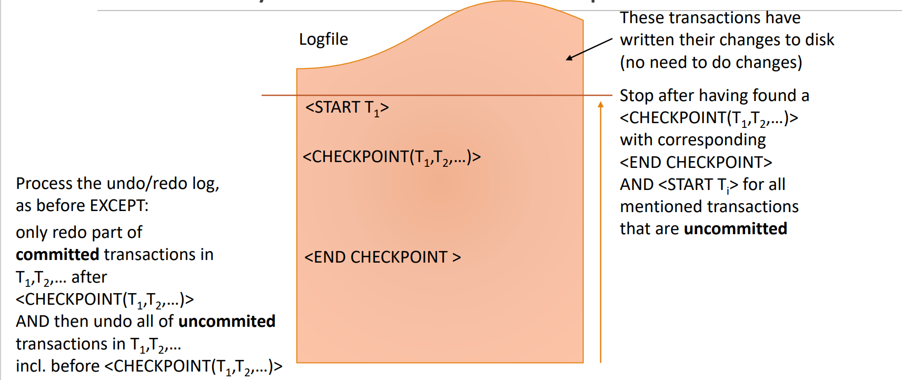
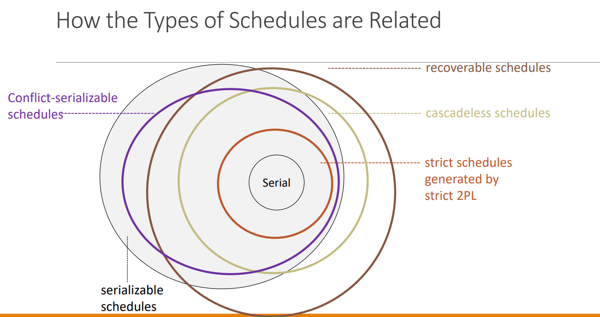

## Transactions

## Schedules


### Checkpoints
```angular2html
Recovery via ARIES Checkpoints

Requirements:
◦ Undo/Redo logging
◦ Transactions do not write to buffers(!) before they are sure they want to commit
Procedure:
◦ Write <CHECKPOINT(T1, T2,…)> in log and flush it
◦ T1, T2,… are the transaction in progress (i.e. not committed and not aborted)
◦ Write the content of the buffer to disk (i.e. output)
◦ Write <END CHECKPOINT> in log and flush it

```





### Schedules (Recoverable | Cascadeless | Strict )


```
Recoverable Schedules

The problem for Durability in regards to cascading rollbacks occur because a transaction T2
reads data from some transaction T1, then T2 commits and afterwards T1 aborts.
A schedule S is recoverable if the following is true:
◦ if a transaction T1 commits and has read an item X that was written before by a different transaction T2, 
◦ then T2 must commit before T1 commits.
```


```
Cascadeless Schedules

A schedule is cascadeless if each transaction in it reads only values that were written by 
transactions that have already committed.

Properties:
- Cascadeless schedules are recoverable
- Cascadeless schedules are in general not serialisable.
```


```
Strict Schedules

A schedule is strict if each transaction in it reads and writes only values that were written by 
transactions that have already committed.

Strict Two-Phase Locking (Strict 2PL)

Enforces both:
◦ Conflict-serialisability 
◦ Strict schedules
Problem: deadlocks

A transaction T must not release any lock (that allows T to write data) until:
• T has committed or aborted, and
• the commit/abort log record has been written to disk.

```





### Detecting deadlocks

```
Timestamps for Deadlock Detection

T1 request an item that is locked by T2: T1->T2

Wait-Die Scheme:(“older transactions alwayswait for unlocks”)
Case 1: T1 is older than T2
T1 is allowed to wait further for T2 to unlock
Case 2: T1 is younger than T2 T1 is rolled back (“dies”)

Wound-Wait Scheme:(“older transactions never wait for unlocks”)
Case 1: T1 is older than T2, T2 is rolled back unless it has finished (it is “wounded”)
Case 2: T1 is younger than T2, T1 is allowed to wait further for T2 to unlock
```


### Timestamp based  schedules

```


```


## Query Processing


## Distributed database


## XML

