# Useful Links
```shell
## design
https://app.diagrams.net/

## database
https://livesql.oracle.com/apex/f?p=590:1000
aaagogool@gmail.com/Aaa-123456

https://www.postgresql.org/docs/12/index.html
https://download.osgeo.org/postgis/windows/pg12/

## dataset

## big data
https://community.cloud.databricks.com/login.html

## 算法
https://www.cs.usfca.edu/~galles/visualization/BPlusTree.html
https://visualgo.net/en/bst

https://scrimba.com/learn/learnjavascript


## Apache
https://jmeter.apache.org/download_jmeter.cgi

## 工具
https://msdn.itellyou.cn/
https://tool.oschina.net/codeformat/json/
https://www.bootschool.net/ascii


##
https://www.python.org/downloads/


## uninstaller geek:  
https://geekuninstaller.com/


```


# Efficiency Tools

```shell
## 效率工具
# Easy Code 插件
点击 File->Settings->Plugins，然后搜索 EasyCode，点击install。
通过 IDEA 上的 Database 连接数据源，即在Database窗口中配置好数据源。
在Database窗口中选中所有的表，然后右键单击，选择 Easy Code->Generate Code。如果，有数据库类型没有对应的 Java 类型，就会有提示，按照提示添加对应关系即可。可以生成entity、dao、mapper、service（接口）、serviceImple、controller等。
如果项目是多模块项目，可以先选择代码生成的 Module，然后设置代码生成的 package，最后从下面勾选要生成的代码模版，点击 OK 即可。
点击 File->Settings->Easy Code->Template Setting，可以对模板进行修改，或者添加新的模板。

## Chrome插件

```


# RDBMS

## DB Concept

ER图


## Normalization

## RA

```
Notations for relational algebra / calculus:
  π - proj
  ρ - rho
  σ - sel
  ⋈ - join
  ∃ - E
  ∈ - in
  ∀ - A
  ¬ - NOT
  ∧ - AND
  ∨ - OR
  ⇒ - =>
  ∪ - union
  ∩ - intersect
  Gavg
  g
  i.e.  { t | E t in Employee E w in Works_in ( e.sin=e.sin and t.fname=e.fname ) }
  i.e. proj (name, age) sel (income >= 18) (Employee join(eid=wid) Works)
```


## SQL

## Advanced SQL

### Postgres function

```
#=
select current_date, now(), age(now(),current_date), date_part('year',age(now(),current_date)),
date_part('hour',age(now(),current_date)), extract(year from age(now(),current_date));

 current_date |              now              |       age       | date_part | date_part | date_part
--------------+-------------------------------+-----------------+-----------+-----------+-----------
 2022-02-22   | 2022-02-22 14:51:34.247261+08 | 14:51:34.247261 |         0 |        14 |         0
(1 row)


```


### MySQL function

### Oracle function

#### 

### MSSQL function

```

-- datediff()
select DATEDIFF("d",getdate(),dateadd("d",1,getdate())),DATEDIFF("d",dateadd("d",1,getdate()),getdate());
1,-1
-- 
select weekday(STR_TO_DATE('2022-06-06','%Y-%m-%d'));
```


## Index

聚集索引：搜索码指定的顺序与文件中记录的物理顺序相同（即包含记录的文件按照某个搜索码指定的顺序排序）

非聚集索引：搜索码指定的顺序与文件中记录的物理顺序相同

聚集索引也称为主索引(primary index)，非聚集索引也称为辅助索引(secondary index)

Non-clustering index: Index whose search key specifies an order different from the sequential order of the file

Non-Clustering indexes are used to quickly find all records whose values in a certain field satisfy some condition.
Non-clustering indexes are also called secondary indexes.
Non-clustering indexes must be dense, i.e., they must include an index entry for every search key value and a pointer to every record in the data file.

tips：索引可以加快检索速度，降低了索引列插入、删除和更新值的速度（即大部分与写入相关的操作的速度）


聚集索引：搜索码指定的顺序与文件中记录的物理顺序相同（即包含记录的文件按照某个搜索码指定的顺序排序）

非聚集索引：搜索码指定的顺序与文件中记录的物理顺序相同

聚集索引也称为主索引(primary index)，非聚集索引也称为辅助索引(secondary index)

Non-clustering index: Index whose search key specifies an order different from the sequential order of the file

Non-Clustering indexes are used to quickly find all records whose values in a certain field satisfy some condition.
Non-clustering indexes are also called secondary indexes.
Non-clustering indexes must be dense, i.e., they must include an index entry for every search key value and a pointer to every record in the data file.

tips：索引可以加快检索速度，降低了索引列插入、删除和更新值的速度（即大部分与写入相关的操作的速度）


## 事务

事务的隔离性和原子性

### 事务概念

ACID特性<br>
原子性：“全或无”。<br>
隔离性：事务的正常执行不会受到并发执行的数据库语句所干扰。 <br>持久性：一个事务成功完成后，它对数据库的改变必须是永久的，即使出现系统故障。 <br>一致性：如果一个事务作为原子从一个一致的数据库状态开始独立地运行，则事务结束时数据库也必须再次是一致的.<br>

– Atomicity
• all database operations (SQL requests) of a transaction must be entirely completed or entirely aborted
– Consistency
• it must take the database from one consistent state to another
– Isolation
• it must not interfere with other concurrent transactions
• data used during execution of a transaction cannot be used by a second transaction until the first one is completed
– Durability
• once completed the changes the transaction made to the data are durable, even in the event of system failure

数据库保证原子性的思路：
对于事务要执行写操作的数据项，数据库系统在磁盘上记录其旧值。这个信息记录在日志文件中。如果事务没能完成它的执行，数据库系统从日志中恢复旧值，使得看上去事务从未执行过。

### 事务可串行化调度

冲突(conflict)：当*I* 和*J* 是不同事务在相同的数据项上的操作，并且其中至少有一个是write指令时，*I* 和*J* 是冲突的。

冲突可串行化(conflict serializable)：若一个调度*S* 与一个串行调度冲突等价，则称调度*S* 是冲突可串行化的。

#### 优先图

判断一个调度是否冲突可串行化---优先图（precedence graph）

如果调度*S* 的优先图有环，则调度*S* 是非冲突可串行化的，如果优先图无环，则调度*S* 是冲突可串行化的。

e.g. 调度*S1* 

|   *T1*   |    *T2*     |
| :------: | :---------: |
| read(A)  |             |
| A:=A-50  |             |
|          |   read(A)   |
|          | temp:=A*0.1 |
|          |  A:=A-temp  |
|          |  write(A)   |
|          |   read(B)   |
| write(A) |             |
| read(B)  |             |
| B:=B+50  |             |
| write(B) |             |
|  commit  |             |
|          |  B:=B+temp  |
|          |  write(B)   |
|          |   commit    |
|          |             |

调度*S1* :R1(A),R2(A),W2(A),R2(B),W1(A),R1(B),W1(B),W2(B)

调度*S1* 优先图：

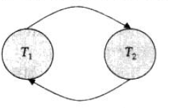 

可恢复调度 (recoverable schedule)：

对于每对事务*Ti* 和*Tj* ，如果*Tj* 读取了之前由*Ti* 所写的数据项，则*Ti* 先于*Tj* 提交。

无级联调度 (cascading schedule)：

对于每对事务*Ti* 和*Tj* ，如果*Tj* 读取了先前由*Ti* 所写的数据项，则*Ti* 必须在*Tj* 这一读操作前提交。容易验证每一个无级联调度也都是可恢复调度。

### 事务隔离性级别

+ 可串行化 (serializable)

+ 可重复读 (repeatable read): 只允许读取已提交数据局，而且在一个事务两次读取一个数据项期间，其他事务不得更新该数据。

+ 已提交读 (read committed): 只允许读取已提交的数据，但不要求可重复读。

+ 未提交读 (read uncommitted): 允许读取未提交数据，SQL允许的最低一致性级别。

  以上所有隔离性级别都不允许脏写（dirty write）																																																																																																																																																																																																	

## 并发控制

死锁检测

多版本机制

两阶段封锁协议 (two-phase locking protocol)：要求每个事务分两个阶段提出加锁和解锁申请
1.增长阶段：事务可以获得锁，但不能释放锁；
2.缩减阶段：事务可以释放锁，但不能获得新锁。


### B+-Tree

```

```


## Security

Access Control

```shell
1 Discretionary access control (DAC)
Based on the concept of access privileges for giving users such privileges.
SQL support DAC; most commercial DBMSs also support DAC.
2 Mandatory access control (MAC)
Based on system-wide policies that cannot be changed by individual users.
SQL doesn’t support MAC but some DBMSs support MAC.
3 Role-based access control (RBAC)
Based on roles (can be used with DAC and MAC).
SQL support privileges on roles; many DBMSs support RBAC

SQL supports DAC through the GRANT and REVOKE commands.
GRANT gives privileges to users;
REVOKE takes away privileges from users.

# syntax
GRANT privileges ON object TO users [WITH GRANT OPTION]
REVOKE [GRANT OPTION FOR] privileges ON object FROM users

```


```sql

Privileges:[SELECT,INSERT, UPDATE, DELETE]
the owner (creator) of a database has all privileges on all objects in the database and can grant privileges to other users.
the owner (creator) of an object has all privileges on 
that object and can pass them on to others.

GRANT ALL ON [tablename] TO [username] WITH GRANT OPTION;
GRANT SELECT, UPDATE(colname) ON [tablename] TO [username];

REVOKE <privileges> ON <object> FROM <users>;

if a user was granted the same privilege from some other user, then they will still keep it.
all other privileges that depend on the revoked one will be revoked automatically.
```


## Transaction


## Concurrency 


Concurrency control
lost update: two different transactions are trying to 
update the same cell at the same time.
uncommitted update ("dirty read"): when a transaction reads data that has been modified by another transaction, but not yet committed


## Abstract Data Types

## Distributed Database Management System (DDBMS)

```
The technical definition of a DDBMS is a DBMS that supports distributed transactions. A DDBMS need not be geographically distributed. One common use of DDBMS technology is high reliability systems with two or more database servers in a fault-tolerant configuration connected by high speed local area networks.
```


MySQL

```


```


# Database

## MySQL

```mysql
## mysql生成日期序列
set @s=1;
select 
@s:=@s+1 as `index`,
date(date_add(CURRENT_DATE,interval @s day)) as `date`
from orders,
(select @s:=1) t
where @s<100;
## 
set @s=0;
with t as
(
select 
@s:=@s+1 as `index`,
date(date_add(@beforeMinDate,interval @s day)) as `date`
from orders
where @s<=(select DATEDIFF(@maxDate,@minDate))
);
```


```ini
## load csv data into table
load data infile '[file_path]'
into table [table_name]
fields terminated by ',' optionally enclosed by '"' escaped by '"'
lines terminated by '\n';

ERROR 1290 (HY000): The MySQL server is running with the --secure-file-priv option so it cannot execute this statement

show variables like '%secure%';
修改my.ini 文件secure-file-priv='/'
编码格式为ANSI
重启mysql服务

ERROR 1261 (01000): Row 39187 doesn't contain data for all columns
mysql> select @@global.sql_mode;
ONLY_FULL_GROUP_BY,STRICT_TRANS_TABLES,NO_ZERO_IN_DATE,NO_ZERO_DATE,ERROR_FOR_DIVISION_BY_ZERO,NO_ENGINE_SUBSTITUTION |
修改my.ini 文件：搜索sql_mode，将strict_trans_tables删除，或者设置为空

## mysql workbench 不支持update
Error Code: 1175. You are using safe update mode and you tried to update a table without a WHERE that uses a KEY column.  To disable safe mode, toggle the option in Preferences -> SQL Editor and reconnect.	0.000 sec

SET SQL_SAFE_UPDATES = 0;


## python连mysql报错
mysql.connector.errors.NotSupportedError: Authentication plugin 'caching_sha2_password' is not supported
mysql.ini 设置 default_authentication_plugin=mysql_native_password
```


```
mysql> grant all privileges on *.* to root@'%' identified by 'root' with grant option;
mysql> flush privileges;

DELIMITER //
CREATE TRIGGER trigger_name
{BEFORE | AFTER}
{UPDATE | INSERT | DELETE} ON table
FOR EACH ROW
BEGIN
variable_declaration
statement_list
END//
DELIMITER ;


```


## PostgreSQL

psql元命令

```
#list databases name
\l 
#list of tablespaces
\db
#查看表定义
\d table_name
#查看表大小
\dt + table_name
#查看索引大小
\di + index_name
#查看函数代码
\sf function_name
#列出所有元命令
\?

\h SQL命令关键字

\timing 启用计时功能
```


```
pgsql允许远程连接
1 修改pg_hba.conf
添加允许访问IP
host all all 0.0.0.0/0 md5
2 修改监听配置
修改 postgresql.conf文件,允许所有的链接
#listen_addresses = 'localhost' # what IP address(es) to listen on;
listen_addresses = '*'         # what IP address(es) to listen on;
```


## PLpgSQL

PLpgSQL = Procedural Language extensions to PostgreSQL

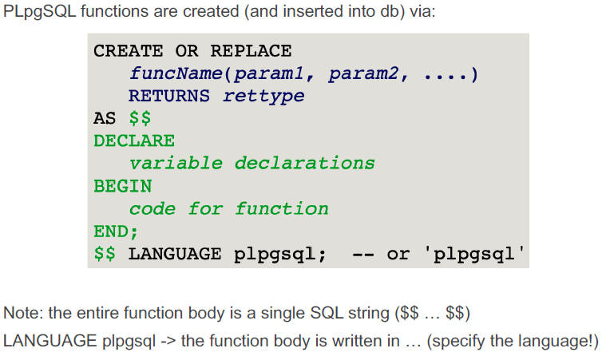


```sql
--pgsql function syntax:
--Beware: never give parameters the same names as attributes.
create or replace function funcName(param1,param2,...) returns rettype
as $$
declare
	... PLpgSQL variable delcarations ...
begin
	... PLpgSQL code ...
end;
$$ language plpgsql
;

```


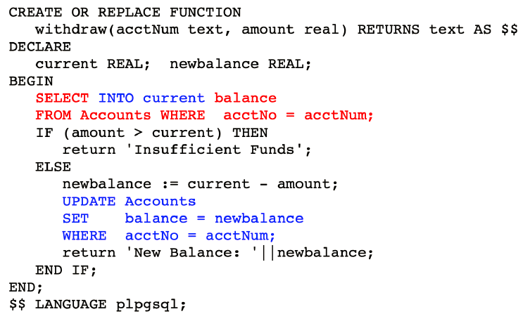

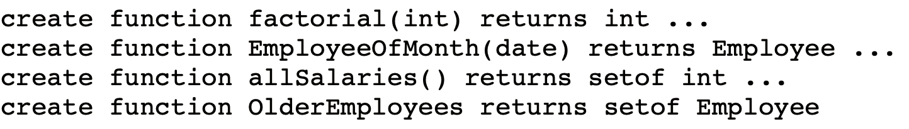

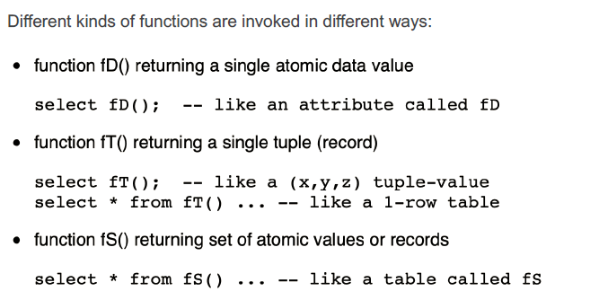

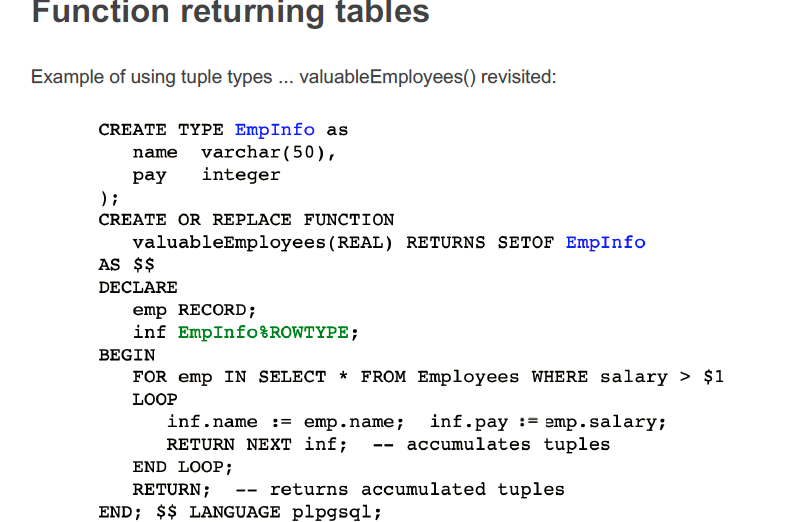


## Oracle

```
# 创建序列
　　语法 CREATE SEQUENCE 序列名 [相关参数]
　　参数说明
　　INCREMENT BY : 序列变化的步进，负值表示递减。(默认1)
　　START WITH : 序列的初始值 。(默认1)
　　MAXvalue : 序列可生成的最大值。(默认不限制最大值，NOMAXVALUE)
　　MINVALUE : 序列可生成的最小值。(默认不限制最小值，NOMINVALUE)
　　CYCLE : 用于定义当序列产生的值达到限制值后是否循环(NOCYCLE:不循环，CYCLE:循环)。
　　CACHE : 表示缓存序列的个数，数据库异常终止可能会导致序列中断不连续的情况，默认值为20，如果不使用缓存可设置NOCACHE
```


# Data Warehouse

􀂃 Why do we need data warehousing? Why not the operational database?
􀂃 What is DW used for? What is the operational DB used for?
􀂃 What is ETL? What is transformation?
􀂃 Why do we need to explore the data in the operational database?
􀂃 Why do we need data cleaning?
􀂃 What is transaction? What is OLTP?
􀂃 What is OLAP?
􀂃 What is the relationship between OLAP and BI? What is BI?

􀂃 What is star schema? What is fact measure?
􀂃 How to identify fact measures? How to identify dimensions?
􀂃 Why must fact measures be numerical values?
􀂃 What is an aggregated value? Why must fact measure be an aggregated value?
􀂃 How to create a dimension? What is the purpose of using group by when
creating the fact table?
􀂃 Where is the PK (FK)?

􀂃 What is a two-column table methodology?
􀂃 What is category?
􀂃 How can we check whether a simple star schema is correct?
􀂃 Why do we need a tempfact? Is tempfact compulsory?
􀂃 Why do we need to create a dimension manually?
􀂃 Why must we update tempfact?

􀂃 How to create a dimension? Why do we use Select Distinct in create dim?
􀂃 What are attributes in dimensions?
􀂃 How many different ways in creating a dimension?
􀂃 When creating a fact table, why don􀂶􀁗 we use the dimension tables?
􀂃 Why do we use the tables in the operational database when creating a fact
table?

􀂃 What is a bridge table? Why is a bridge table needed?
􀂃 What are the three versions of Product-Supplier bridge tables?
􀂃 What is weight factor and ListAGG? Where are these two attributes located?
􀂃 How to create a dimension with weight factor and ListAGG?
􀂃 Is ListAGG needed? When is weight factor needed?
􀂃 How to calculate the fact measure after averaging with weight factor?

􀂃 Why do we need temporary dimensions?
􀂃 How to create a temporary dimension?
􀂃 Why do we need temporary tables in operational database?
􀂃 How to create a temporary table in operational database?

􀂃 Why use two separate dim? Why not combine into one dim? Is it for drilling
down?
􀂃 What is hierarchy in dimension? Why use hierarchy?
􀂃 What is normalization in dimension?
􀂃 Why not have a combined dimension? What is the difference between hierarchy
and non-hierarchy in dimension modelling?

􀂃 What is a determinant dimension?
􀂃 When to use a determinant dimension?
􀂃 How to identify whether a dimension is a determinant dimension?

􀂃 What is a 􀂳One-a􀁗􀁗􀁕ib􀁘􀁗e􀂴 dim? What is the impact to the fact?
􀂃 What is the problem of AVG in the fact?
􀂃 What is the granularity of a dimension? What is the level of granularity?

􀂃 Can we have multiple fact measures? Do we need to separate into multi facts?
􀂃 What is subject-oriented in data warehousing
􀂃 Can dimensions be shared?
􀂃 How to determine multi-fact?
􀂃 How to combine several facts into one (the Robcor case study)?
􀂃 Why do we need to consider co-pilot?

􀂃 What types of mistakes are there?
􀂃 How to explore data? How to find mistakes?
􀂃 How to correct mistakes? Should all mistakes be corrected?

􀂃 What is temporal data warehousing?
􀂃 Why is a temporal data warehousing needed?
􀂃 How to implement a temporal star schema?
􀂃 How to calculate the fact measure correctly?
􀂃 Temporal attributes vs. temporal dimensions
􀂃 What is SCD?
􀂃 What are SCD types?

􀂃 CUBE, ROLL UP
􀂃 Grouping, Decode
􀂃 Partial Cube, Partial Roll Up
􀂃 Rank, Dense Rank, Percent Rank, Row Number
􀂃 Cumulative and Moving Aggregate
􀂃 Partition

## Data Warehouse intro

A data warehouse is a multi-dimensional view of databases, with aggregates and pre-computed summaries.
➢ In many ways, it is basically doing aggregates in advance; that is exactly precomputation done at the design level, rather than at the query level

There are two important parts about data warehousing: building it, and using it

* Building data warehouse

A data warehouse is created by transforming an operational database to a data warehouse.

The transformation includes a series of steps of data manipulation.
➢ such as extracting, cleaning, aggregating, summarizing, combining, altering, appending, etc
➢ all of which are called an Extract-Transform-Load or an ETL

* Using data warehouse

Using a data warehouse means to extract data from the data warehouse for further data analysis.
▪ The query to extract data from the data warehouse is an Online Analytical Tool or OLAP.
▪ OLAP retrieves raw data, which can then be later formatted using any Business Intelligence (BI) tools.
➢ In OLAP, the focus is on the data – the retrieved data is the most important.
➢ The BI tool is for further presentation and visualization.
➢ BI tools which receive the raw data can present the data in any forms: reports, graphs, dashboards, etc.

* BI (Business intelligence)

Business intelligence (BI) is a term that describes a comprehensive, cohesive, and integrated set of tools and processes used to capture, collect, integrate, store, and analyze data with the purpose of generating and presenting information to   support business decision making.
▪ BI is a framework that allows a business to transform data into information, information into knowledge, and knowledge into wisdom.

In general, BI provides a framework for:
➢ Collecting and storing operational data
➢ Aggregating the operational data into decision support data
➢ Analyzing decision support data to generate information
➢ Presenting such information to the end user to support business decisions
➢ Making business decisions, which in turn generate more data that is collected, stored, and so on (restarting the process)
➢ Monitoring results to evaluate outcomes of the business decisions, which again provides more data to be collected, stored, and so on
➢ Predicting future behaviors and outcomes with a high degree of accuracy

## Star Schema

▪ A Star Schema is a design representation of a multi-dimensional view. It is a data modeling technique used to map multidimensional decision support data into a relational database.
▪ The reason for the star schema’s development is that existing relational modeling techniques: ER and normalization, did not yield a database structure that served the advanced data analysis requirements well.

* There are Three main components of the Star Schema:
  1. Facts
  2. Dimensions
  3. Attributes

1. Facts
   Facts are numeric measurements (values) that represent a specific business aspect or activity.
   For example, sales figures are numeric measurements that represent product and/or service sales.
2. Dimensions
   Dimensions are qualifying characteristics that provide additional perspectives to a given fact.
   For example, sales might be viewed from specific dimension(s), such as sales location, sales period, sales product, etc
3. Attributes
   Each dimension table contains attributes.

* Transformation Process 

  Operational Database----->Data warehouse

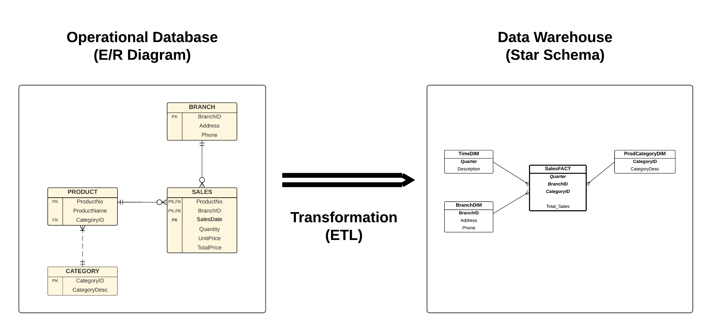

Two-Column Table Methodology

One Fact Measurement:

When creating a star schema, you need to imagine that the data you want to analyse consists of two columns.
The first column is the category (e.g. A, C,D, E), and the second column is the statistical numerical figure (e.g. B).
The second column (e.g. B) has to be consistent throughout all the two-column tables.

Multiple Fact Measurements:

The second column in the two-column tables, which is the numerical fact measurement (e.g. column B) can actually be multiple columns (call them: B1, B2, B3), as long as all of these columns (e.g. B1, B2, B3) relate to all of the categories (e.g. A, C, D, E).

### Star Schema

1. Facts
2. Dimensions
3. Attributes

Star Schema Components

1. Facts
   Facts are numeric measurements (values) that represent a specific business aspect or activity.
   For example, sales figures are numeric measurements that represent product and/or service sales.
2. Dimensions
   Dimensions are qualifying characteristics that provide additional perspectives to a given fact.
   For example, sales might be viewed from specific dimension(s), such as sales location, sales period, sales product, etc.

Two Column Table Methodology

One Fact Measurement:
When creating a star schema, you need to imagine that the data you want to analyse consists of two columns.
The first column is the category (e.g. A, C, D, E), and the second column is the statistical numerical figure (e.g. B).
The second column (e.g. B) has to be consistent throughout all the two-column tables.

Multiple Fact Measurements:
The second column in the two-column tables, which is the numerical fact measurement (e.g. column B) can actually be multiple columns (call them: B1, B2, B3), as long as all of these columns (e.g. B1, B2, B3) relate to all of the categories (e.g. A, C, D, E).

### Bridge Tables

#### Bridge Tables

A bridge table is a table that links between two dimensions; and only one of these two dimensions are linked to the fact.
➢ As a result, the star schema becomes a snowflake schema.

Two reasons on why a dimension cannot be connected directly to the Fact

a) The Fact table has a fact measure, and the dimension has a key identity. In order to connect a dimension to the Fact, the dimension’s key identity must contribute directly to the calculation of the fact measure. Unfortunately, this cannot happen if the operational database does not have this data.
b) The operational database does not have this data if the relationship between two entities in the operational database that hold the information about dimension’s key identity and the intended fact measure is a many-many relationship.

A weight factor is only needed if we want to estimate the contribution that a dimension made to the fact

▪ In principal, a Bridge Table is used:
a) When it is impossible to have a dimension connected directed to the Fact table, because simply there is no relationship between this dimension and the Fact table (e.g. in the Product Sales case study, it is impossible to have a direct link from SupplierDim to ProductSalesFact)
b) When an entity (which will become a dimension) has a many-many relationship with another entity (dimension) in the E/R schema of the operational database (e.g. Supplier and Stock has a many-many relationship).
c) When temporality aspect (data history) is maintained in the operational database and the bridge table can be used to accommodate the dimension that has temporal attributes (e.g. product supply history is maintained in the second snowflake schema example).

▪When a Bridge Table is used in the schema, there are two additional options:
a) A Weight Factor is used to estimate the contribution of a dimension in the calculation of the fact measure. Because this is only an estimate, a weight factor is option.
b) Every snowflake schema (whether it has Weight Factor or not) can be implemented in two ways: a List Aggregate version, and a non-List Aggregate version.

#### Temporary Dimension Tables

Temporary dimension tables needed when it is not possible to create a dimension table directly; need to apply a series of additional steps when creating a dimension table through the creation of an intermediate table.

Temporary table in operational database

Tables in the operational database are not readily used to create the Fact table. Need transformation phase where  an intermediate table, called the Temporary Operational Database Table is created.

### Snowflake Schema

#### Hierarchies

A Hierarchy is formed when a dimension is broken down to two or more dimensions in a hierarchical manner.
➢ As a result, the star schema becomes a snowflake schema.

Hierarchy vs. Non-Hierarchy

1. One table vs. many tables
   The consequence is in the join query processing when producing reports.
2. Normalized vs. Un-normalized
   With the hierarchy option, the tables are normalized, which follows the relational model. In contrast, the non-hierarchy option, the table (e.g. the Campus Dimension table) is unnormalized, which is basically 1NF with visible replication on information, which is prone to anomalies (e.g. insert, update, and delete anomalies).
3. Drilling down and rolling up
   The hierarchy model is not about drilling down information exploration.

Hierarchy vs. Non-Hierarchy – Summary

▪ From the query point of view, both versions need two queries.
▪ From the query processing point of view, the non-hierarchy version uses one join operation only, because it only needs to join the fact and one dimension.
▪ From the conceptual point of view, the hierarchy model does not actually offer a better roll up or drill down features.

Hierarchy – Summary

A dimension hierarchy is connecting two or more dimensions in a hierarchical manner, using a many-1 relationship.
➢ As a result, the dimensions in a hierarchy are normalized, in 3NF, using the context of Relational Database Design.

#### Determinant Dimensions

Determinant vs. Non-Determininant Dimensions

Type dimension is a good candidate for a determinant dimension, but need further examination to check if it is really a determinant dimension.

Non-type dimension can potentially be a determinant dimension.

Determinant Dimensions vs. Pivoted Fact Table

Fact measures for all the ... means the fact table is a Pivoted Fact Table

Pivoted Fact Table, in which for each record in the fact table, it can be seen as a 2D matrix between the dimension key identifiers and the *num(such as five)* fact measures.

Average in the Fact is not desirable, although technically it satisfies the two criteria of the fact (e.g. must be a numerical and aggregate value).
▪ Min and Max in the Fact can still be used, since Min Score and Max Score are valid fact measures (e.g. they are numerical and aggregated values).
▪ In general, count and sum are more common.


One Attribute Dimensions

Dimensions with only one attribute (i.e. key attribute)

Junk Dimensions--Combine all one attribute dimensions.


Multi-Fact

A Subject-Oriented data warehouse means that one star schema focuses on one subject only.
➢ A subject refers to a topic of analysis.
▪ Example:
➢ Sales of properties & Rental properties
o The two star schemas should not be combined since both focus on different subjects.
o But two separate star schemas can still share the same dimensions

## Temporal Data Warehousing

* Temporal (or historical) aspect of records is incorporated into data warehouse. e.g. keeping track of book price changes over time.

* Also known as Slowly Chaning Dimensions (SCD)

* Temporal Attribute
  An attribute in which the value of that attribute has a life-span. e.g. each book price has a life-span, and it is determined by the StartDate and EndDate attributes in the BookPriceDim table.

* Temporal Dimensions
  Temporal Dimension is a dimension where the record of the dimension has a specific life span.

* Slow Changing Dimensions(SCD) 
  Dimensions where the records of these dimensions change slowly over a period of time.
  These are related to real-time data warehousing (stream data warehousing)

* SCD type

  type0 : the dimension stores the "Original or Initial" value of the records, when the data warehousing is bulit. e.g. full price of books will be recorded in the book dimension.

  type1: It only records the  latest vaule of the record. e.g. the lastest price of books will be recorded in the book dimension.

  type2: keeps track of the history from the main dimension. (new id and new value) e.g. when the price of a book is changed, "another book" with the same details is created, with the new book_id and new price. 

  type3: simplification of type 2, maintains only the current and the previous values, not the entrie history. e.g. only the last two prices of the book are recorded.

  type4: create a new dimension to maintain the history of attribute value change. e.g. bookpriceDim.
  main advantage: do not need to have a different bookid for the same book, additionally, the entire history of changes is kept.

  type6: conbination of type2 and type3. A separate identifier for the same book is not needed, but the entrie history is kept.

  summary:

  type 0 vs type1: both types do not actually record the history of changes in the dimension.

  type0,1,3: not contain entrie history.

  type2,4,6: contain entrie history. but 6 is unnecessary.

## Data warehousing Case

### case --product sales

```sql
--A company management team would like to analyze the statistics of its product sales history. The analysis is needed to identify popular products, suppliers supplying those products, the best time to purchase more stock, etc.
--▪ A small data warehouse is to be built to keep track of the statistics.
--▪ The management is particularly interested in analyzing the total sales (quantity * price) by product, customer suburbs, sales time periods (month and year), and supplier.
--▪ The management is particularly interested in analyzing the total sales (quantity * price) by product, customer suburbs, sales time periods (month and year), and supplier.


drop table if exists stock_supplier;
drop table if exists stock;
drop table if exists salesitem;
drop table if exists sales;
drop table if exists staff;
drop table if exists product;
drop table if exists customer;
drop table if exists supplier;
---关系数据库
create table customer(
customer_id int primary key,
name varchar(20),
address varchar(50),
suburb varchar(20),
postcode varchar(10),
state varchar(10),
phone_num varchar(10)
);


create table staff(
staff_id int primary key,
name varchar(20),
position varchar(20),
branch varchar(20)
);

create table product(
product_no varchar(20) primary key,
product_name varchar(50),
product_type varchar(20),
price int
);

create table stock(
product_no varchar(20),
location varchar(20),
qtyin_stock int,
primary key (product_no,location),
constraint fk_stock_pro foreign key (product_no) references product(product_no)
);

create table sales(
sales_no int primary key,
customer_id int,
payment_type varchar(20),
paid int,
staff_id int,
sales_date date,
constraint fk_sales_cus foreign key(customer_id) references customer(customer_id),
constraint fk_sales_staff foreign key (staff_id) references staff(staff_id)
);           


create table salesitem(
sales_no int,
product_no varchar(20),
qty_sold int,
primary key(sales_no,product_no),
constraint fk_salesitem_sale foreign key (sales_no) references sales(sales_no),
constraint fk_salesitem_pro foreign key (product_no) references product(product_no)
);

create table supplier(
supplier_id int primary key,
name varchar(20),
address varchar(50),
suburb varchar(20),
postcode varchar(10),
state varchar(10),
phone_num varchar(10)
);

create table stock_supplier(
product_no varchar(20),
supplier_id int,
supply_date date,
location varchar(20),
qty_supplied int,
primary key(product_no,supplier_id,supply_date,location),
constraint fk_stksup_pro foreign key(product_no,location) references stock(product_no,location),
constraint fk_stksup_sup foreign key(supplier_id) references supplier(supplier_id)
);


---building data warehouse

```

### case--A  Truck Delivery (Bridge Table)

A trucking company is responsible for picking up shipments from warehouses of a retail chain called MYER, and delivering the shipments to individual retail store of MYER. A truck may carry several shipments during a single trip, which is identified by TripID, and delivers those shipments to multiple stores. Trucks have different capacities for both the volumes they can hold and the weights they can carry. At the moment, a truck makes several trips each week. An operational database is being used to keep track the deliveries, including the scheduling of trucks, which provide timely deliveries to stores. The following is an E/R diagram of the truck delivery system.


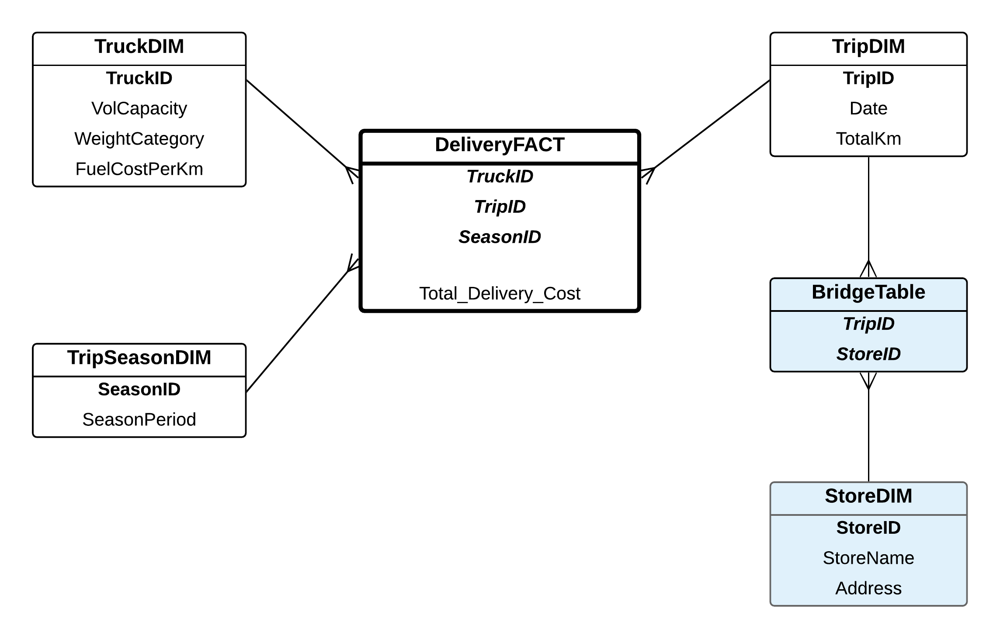


```sql
--operational database
Create Table Warehouse
(WarehouseID varchar(10) Not Null,
Location varchar(10) Not Null,
Primary Key (WarehouseID)
);
Create Table Truck
(TruckID varchar(10) Not Null,
VolCapacity numeric(5,2),
WeightCategory varchar(10),
CostPerKm numeric(5,2),
Primary Key (TruckID)
);
Create Table Trip
(TripID varchar(10) Not Null,
TripDate Date,
TotalKm numeric(5),
TruckID varchar(10),
Primary Key (TripID),
Foreign Key (TruckID) References Truck(TruckID)
);
Create Table TripFrom
(TripID varchar(10) Not Null,
WarehouseID varchar(10) Not Null,
Primary Key (TripID, WarehouseID),
Foreign Key (TripID) References Trip(TripID),
Foreign Key (WarehouseID) References Warehouse(WarehouseID)
);
Create Table Store
(StoreID varchar(10) Not Null,
StoreName varchar(20),
StoreAddress varchar(20),
Primary Key (StoreID)
);
Create Table Destination
(TripID varchar(10) Not Null,
StoreID varchar(10) Not Null,
Primary Key (TripID, StoreID),
Foreign Key (TripID) References Trip(TripID),
Foreign Key (StoreID) References Store(StoreID)
);
--Insert Records to Operational Database
Insert Into Warehouse Values ('W1','Warehouse1');
Insert Into Warehouse Values ('W2','Warehouse2');
Insert Into Warehouse Values ('W3','Warehouse3');
Insert Into Warehouse Values ('W4','Warehouse4');
Insert Into Warehouse Values ('W5','Warehouse5');
Insert Into Truck Values ('Truck1', 250, 'Medium', 1.2);
Insert Into Truck Values ('Truck2', 300, 'Medium', 1.5);
Insert Into Truck Values ('Truck3', 100, 'Small', 0.8);
Insert Into Truck Values ('Truck4', 550, 'Large', 2.3);
Insert Into Truck Values ('Truck5', 650, 'Large', 2.5);
Insert Into Trip Values ('Trip1', to_date('14-Apr-2013', 'DD-MON-YYYY'), 370, 'Truck1');
Insert Into Trip Values ('Trip2', to_date('14-Apr-2013', 'DD-MON-YYYY'), 570, 'Truck2');
Insert Into Trip Values ('Trip3', to_date('14-Apr-2013', 'DD-MON-YYYY'), 250, 'Truck3');
Insert Into Trip Values ('Trip4', to_date('15-Jul-2013', 'DD-MON-YYYY'), 450, 'Truck1');
Insert Into Trip Values ('Trip5', to_date('15-Jul-2013', 'DD-MON-YYYY'), 175, 'Truck2');
Insert Into TripFrom Values ('Trip1', 'W1');
Insert Into TripFrom Values ('Trip1', 'W4');
Insert Into TripFrom Values ('Trip1', 'W5');
Insert Into TripFrom Values ('Trip2', 'W1');
Insert Into TripFrom Values ('Trip2', 'W2');
Insert Into TripFrom Values ('Trip3', 'W1');
Insert Into TripFrom Values ('Trip3', 'W5');
Insert Into TripFrom Values ('Trip4', 'W1');
Insert Into TripFrom Values ('Trip5', 'W4');
Insert Into TripFrom Values ('Trip5', 'W5');
Insert Into Store Values ('M1', 'Myer City', 'Melbourne');
Insert Into Store Values ('M2', 'Myer Chaddy', 'Chadstone');
Insert Into Store Values ('M3', 'Myer HiPoint', 'High Point');
Insert Into Store Values ('M4', 'Myer West', 'Doncaster');
Insert Into Store Values ('M5', 'Myer North', 'Northland');
Insert Into Store Values ('M6', 'Myer South', 'Southland');
Insert Into Store Values ('M7', 'Myer East', 'Eastland');
Insert Into Store Values ('M8', 'Myer Knox', 'Knox');
Insert Into Destination Values ('Trip1', 'M1');
Insert Into Destination Values ('Trip1', 'M2');
Insert Into Destination Values ('Trip1', 'M4');
Insert Into Destination Values ('Trip1', 'M3');
Insert Into Destination Values ('Trip1', 'M8');
Insert Into Destination Values ('Trip2', 'M4');
Insert Into Destination Values ('Trip2', 'M1');
Insert Into Destination Values ('Trip2', 'M2');

---building
create table truck_dim
as 
select distinct truckID,volcapacity,weightcategory,costperkm as fuelcostperkm
from truck;

create table trip_dim
as
select distinct tripID,tripdate,totalkm
from trip;

create table bridge_table
as
select distinct tripID,storeID
from destination;

create table store_dim
as 
select * from store;


--tripdim with a weightfactor
create table TripDim2 as
select T.TripID, T.TripDate, T.TotalKm,
1.0/count(*) as WeightFactor
from Trip T, Destination D
where T.TripID = D.TripID
group by T.tripid, T.tripdate, T.totalkm;

--tripdim with a  weightfactor& listagg
--pg
create table TripDim3 as
select T.TripID, T.TripDate, T.TotalKm,
1.0/count(D.StoreID) as WeightFactor,
string_agg(D.StoreID, '_')  as StoreGroupList
from Trip T, Destination D
where T.TripID = D.TripID
group by T.TripID, T.TripDate, T.TotalKm;

--oracle
--LISTAGG (attr1, '_') Within Group (Order By attr1) As columnname
create table TripDim3 as
select T.TripID, T.TripDate, T.TotalKm,
1.0/count(D.StoreID) as WeightFactor,
listagg(D.StoreID, '_') within group
(order by D.StoreID) as StoreGroupList
from Trip T, Destination D
where T.TripID = D.TripID
group by T.TripID, T.TripDate, T.TotalKm;

```

combining Trips: tripGroupList

```sql
---未验证
create table TripGroupListDimTemp as
select T.TripID,T.TripDate,T.TotalKm,
1.0/count(D.StoreID) as WeightFactor,
listagg(D.StoreID,'_') within group (order by D.StoreID) as StoreGroupList
from Trip T,Destination D
where T.TripID=D.TripID
group by T.TripID,T.TripDate,T.TotalKm;

alter table TripGroupListDimTemp
add (SeasonID varchar(10));

update TripGroupListDimTemp
set SeasonID='Summer' where to_char(TripDate,'MM') in ('12','01','02');
update TripGroupListDimTemp
set SeasonID='Autumn' where to_char(TripDate,'MM') in ('03','04','05');
update TripGroupListDimTemp
set SeasonID='Winter' where to_char(TripDate,'MM') in ('06','07','08');
update TripGroupListDimTemp
set SeasonID='Spring' where to_char(TripDate,'MM') in ('09','10','11');

create table TripGroupListDim as
select 
listagg(TripID,'_') within group (order by TripID) as TripGroupListID,
sum(TotalKm) as TotalKm,
WeightFactor,StoreGroupList
from TripGroupListDimTemp
group by SeasonID,WeightFactor,StoreGroupList;
```


### case-A book shop (temporal scd)

Border bookstore that has a number of branches in Melbourne would like to build a data warehouse to analyze their book sales. They have already stored all book sales transactions in an operational database. The management would particularly like to analyze their book sales performance from various perspectives, such as monthly basis, book basis, and branch basis. The following is an E/R diagram of the Bookshop system.

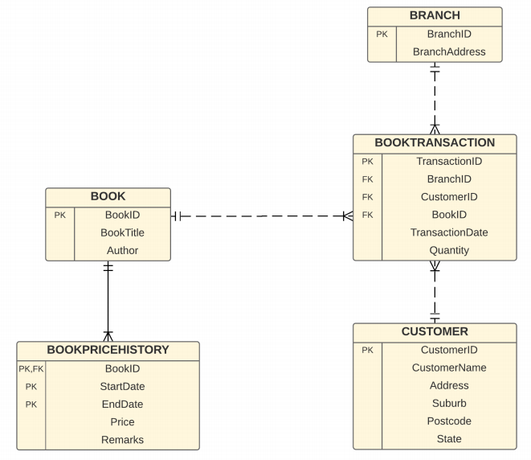

```sql
--pg实现版 Oracle把numeric改成number，varchar改成varchar2
--CUSTOMER
create table customer(
customer_id varchar(10),
customer_name varchar(20),
address varchar(20),
suburb varchar(20),
postcode varchar(20),
state varchar(20),
primary key (customer_id)
);

insert into Customer values('Cus1','Cus1','ADDR1','SUB1','POST1','STATE1');
insert into Customer values('Cus2','Cus2','ADDR2','SUB2','POST2','STATE2');
insert into Customer values('Cus3','Cus3','ADDR3','SUB3','POST3','STATE3');
insert into Customer values('Cus4','Cus4','ADDR4','SUB4','POST4','STATE4');
insert into Customer values('Cus5','Cus5','ADDR5','SUB5','POST5','STATE5');
insert into Customer values('Cus6','Cus6','ADDR6','SUB6','POST6','STATE6');
insert into Customer values('Cus7','Cus7','ADDR7','SUB7','POST7','STATE7');
insert into Customer values('Cus8','Cus8','ADDR8','SUB8','POST8','STATE8');
insert into Customer values('Cus9','Cus9','ADDR9','SUB9','POST9','STATE9');
insert into Customer values('Cus10','Cus10','ADDR10','SUB1','POST1','STATE1');
insert into Customer values('Cus11','Cus11','ADDR11','SUB1','POST1','STATE1');
insert into Customer values('Cus12','Cus12','ADDR12','SUB1','POST1','STATE1');
insert into Customer values('Cus13','Cus13','ADDR13','SUB1','POST1','STATE1');

 --BOOK
create table BOOK
(
BOOK_ID varchar(20) not null ,
BOOK_TITLE varchar(200),
AUTHOR varchar(200)
) ;
alter table BOOK add constraint BOOK_PK primary key ( BOOK_ID ) ;
insert into BOOK values('C1', 'CSIRO Diet', 'CSIRO Team');
insert into BOOK values('H6', 'Harry Potter 6', 'Rowling');
insert into BOOK values('DV', 'Da Vinci Code', 'Dan Brown');
--BOOK PRICE HISTORY
create table BOOK_PRICE_HISTORY
(
BOOK_ID varchar(20) not null ,
START_DATE varchar(10) null ,
END_DATE varchar(10) not null ,
PRICE numeric ,
REMARKS varchar(100)
) ;
alter table BOOK_PRICE_HISTORY add constraint BOOK_PRICE_HISTORY_PK primary key ( BOOK_ID, START_DATE, END_DATE ) ;
alter table BOOK_PRICE_HISTORY add constraint BOOK_PRICE_HISTORY_BOOK_FK foreign key ( BOOK_ID ) references BOOK ( BOOK_ID ) ;
insert into BOOK_PRICE_HISTORY values('C1', 'Jan2007', 'Jan2007', 45.95, 'Full Price');
insert into BOOK_PRICE_HISTORY values('C1', 'Aug2007', 'Oct2007', 45.95, 'Full Price');
insert into BOOK_PRICE_HISTORY values('C1', 'Nov2007', 'Jan2008', 45.95, 'Full Price');
insert into BOOK_PRICE_HISTORY values('C1', 'Feb2008', 'Now', 45.95, 'Full Price');
insert into BOOK_PRICE_HISTORY values('H6', 'Jan2007', 'Mar2007', 21.95, 'Launching');
insert into BOOK_PRICE_HISTORY values('H6', 'Apr2007', 'Feb2008', 30.95, 'Full Price');
insert into BOOK_PRICE_HISTORY values('H6', 'Jan2008', 'Now', 10.00, 'End of Product Sale');
insert into BOOK_PRICE_HISTORY values('DV', 'Jan2007', 'Now', 27.95, 'Full Price');


--BRANCH
create table BRANCH
(
BRANCH_ID varchar(100) not null ,
BRANCH_ADDRESS varchar(200)
) ;
alter table BRANCH add constraint BRANCH_PK primary key ( BRANCH_ID ) ;
insert into BRANCH values('City', 'VIC3622');
insert into BRANCH values('Chadstone', 'Chadstone VIC3234');
insert into BRANCH values('Camberwell', 'Camberwell VIC2451');

--TRANSACTION
create table BOOK_TRANSACTION
(
TRANSACTION_ID numeric not null ,
BRANCH_ID varchar (100) not null ,
CUSTOMER_ID varchar (20) not null ,
BOOK_ID varchar (20) not null ,
TRANSACTION_DATE date ,
QUANTITY numeric
) ;
alter table BOOK_TRANSACTION add constraint BOOK_TRANSACTION_PK primary key ( TRANSACTION_ID ) ;
alter table BOOK_TRANSACTION add constraint TRANSACTION_BOOK_FK foreign key ( BOOK_ID ) references BOOK ( BOOK_ID ) ;
alter table BOOK_TRANSACTION add constraint TRANSACTION_BRANCH_FK foreign key ( BRANCH_ID ) references BRANCH ( BRANCH_ID ) ;
alter table BOOK_TRANSACTION add constraint TRANSACTION_CUSTOMER_FK foreign key ( CUSTOMER_ID ) references CUSTOMER ( CUSTOMER_ID ) ;

create sequence BOOK_TRANSACTION_TRANSACTION_I start with 1 ;


insert into BOOK_TRANSACTION values(nextval('BOOK_TRANSACTION_TRANSACTION_I'), 'City', 'Cus1', 'C1', to_date('Mar 2008', 'Mon YYYY'), 2);
insert into BOOK_TRANSACTION values(nextval('Book_TRANSACTION_TRANSACTION_I'), 'City', 'Cus2', 'C1', to_date('Mar 2008', 'Mon YYYY'), 3);
insert into BOOK_TRANSACTION values(nextval('Book_TRANSACTION_TRANSACTION_I'), 'City', 'Cus2', 'H6', to_date('Mar 2008', 'Mon YYYY'), 10);
insert into BOOK_TRANSACTION values(nextval('Book_TRANSACTION_TRANSACTION_I'), 'City', 'Cus3', 'H6', to_date('Mar 2008', 'Mon YYYY'), 5);
insert into BOOK_TRANSACTION values(nextval('Book_TRANSACTION_TRANSACTION_I'), 'City', 'Cus3', 'DV', to_date('Mar 2008', 'Mon YYYY'), 10);
insert into BOOK_TRANSACTION values(nextval('Book_TRANSACTION_TRANSACTION_I'), 'City', 'Cus4', 'DV', to_date('Mar 2008', 'Mon YYYY'), 13);
insert into BOOK_TRANSACTION values(nextval('Book_TRANSACTION_TRANSACTION_I'), 'Chadstone', 'Cus4', 'C1', to_date('Mar 2008', 'Mon YYYY'), 10);
insert into BOOK_TRANSACTION values(nextval('Book_TRANSACTION_TRANSACTION_I'), 'Chadstone', 'Cus5', 'C1', to_date('Mar 2008', 'Mon YYYY'), 5);
insert into BOOK_TRANSACTION values(nextval('Book_TRANSACTION_TRANSACTION_I'), 'Chadstone', 'Cus4', 'H6', to_date('Mar 2008', 'Mon YYYY'), 3);
insert into BOOK_TRANSACTION values(nextval('Book_TRANSACTION_TRANSACTION_I'), 'Chadstone', 'Cus3', 'DV', to_date('Mar 2008', 'Mon YYYY'), 2);
insert into BOOK_TRANSACTION values(nextval('Book_TRANSACTION_TRANSACTION_I'), 'Camberwell', 'Cus3', 'C1', to_date('Mar 2008', 'Mon YYYY'), 1);
insert into BOOK_TRANSACTION values(nextval('Book_TRANSACTION_TRANSACTION_I'), 'Camberwell', 'Cus2', 'H6', to_date('Mar 2008', 'Mon YYYY'), 1);
insert into BOOK_TRANSACTION values(nextval('Book_TRANSACTION_TRANSACTION_I'), 'Camberwell', 'Cus1', 'DV', to_date('Mar 2008', 'Mon YYYY'), 2);
insert into BOOK_TRANSACTION values(nextval('Book_TRANSACTION_TRANSACTION_I'), 'City', 'Cus4', 'C1', to_date('Dec 2007', 'Mon YYYY'), 10);
insert into BOOK_TRANSACTION values(nextval('Book_TRANSACTION_TRANSACTION_I'), 'City', 'Cus3', 'C1', to_date('Dec 2007', 'Mon YYYY'), 5);
insert into BOOK_TRANSACTION values(nextval('Book_TRANSACTION_TRANSACTION_I'), 'City', 'Cus2', 'H6', to_date('Dec 2007', 'Mon YYYY'), 5);
insert into BOOK_TRANSACTION values(nextval('Book_TRANSACTION_TRANSACTION_I'), 'City', 'Cus2', 'H6', to_date('Dec 2007', 'Mon YYYY'), 1);
insert into BOOK_TRANSACTION values(nextval('Book_TRANSACTION_TRANSACTION_I'), 'City', 'Cus5', 'DV', to_date('Dec 2007', 'Mon YYYY'), 6);
insert into BOOK_TRANSACTION values(nextval('Book_TRANSACTION_TRANSACTION_I'), 'Chadstone', 'Cus4', 'C1', to_date('Dec 2007', 'Mon YYYY'), 5);
insert into BOOK_TRANSACTION values(nextval('Book_TRANSACTION_TRANSACTION_I'), 'Chadstone', 'Cus3', 'C1', to_date('Dec 2007', 'Mon YYYY'), 5);
insert into BOOK_TRANSACTION values(nextval('BOOK_TRANSACTION_TRANSACTION_I'), 'Chadstone', 'Cus2', 'H6', to_date('Dec 2007', 'Mon YYYY'), 4);
insert into BOOK_TRANSACTION values(nextval('BOOK_TRANSACTION_TRANSACTION_I'), 'Chadstone', 'Cus1', 'H6', to_date('Dec 2007', 'Mon YYYY'), 4);
insert into BOOK_TRANSACTION values(nextval('BOOK_TRANSACTION_TRANSACTION_I'), 'Chadstone', 'Cus4', 'DV', to_date('Dec 2007', 'Mon YYYY'), 1);
insert into BOOK_TRANSACTION values(nextval('BOOK_TRANSACTION_TRANSACTION_I'), 'Camberwell', 'Cus1', 'C1', to_date('Dec 2007', 'Mon YYYY'), 9);
insert into BOOK_TRANSACTION values(nextval('BOOK_TRANSACTION_TRANSACTION_I'), 'Camberwell', 'Cus3', 'C1', to_date('Dec 2007', 'Mon YYYY'), 9);
insert into BOOK_TRANSACTION values(nextval('BOOK_TRANSACTION_TRANSACTION_I'), 'Camberwell', 'Cus2', 'H6', to_date('Dec 2007', 'Mon YYYY'), 3);
insert into BOOK_TRANSACTION values(nextval('BOOK_TRANSACTION_TRANSACTION_I'), 'Camberwell', 'Cus1', 'DV', to_date('Dec 2007', 'Mon YYYY'), 2);
insert into BOOK_TRANSACTION values(nextval('BOOK_TRANSACTION_TRANSACTION_I'), 'Chadstone', 'Cus4', 'DV', to_date('Dec 2007', 'Mon YYYY'), 1);
insert into BOOK_TRANSACTION values(nextval('BOOK_TRANSACTION_TRANSACTION_I'), 'Camberwell', 'Cus1', 'C1', to_date('Dec 2007', 'Mon YYYY'), 9);
insert into BOOK_TRANSACTION values(nextval('BOOK_TRANSACTION_TRANSACTION_I'), 'Camberwell', 'Cus3', 'C1', to_date('Dec 2007', 'Mon YYYY'), 9);
insert into BOOK_TRANSACTION values(nextval('BOOK_TRANSACTION_TRANSACTION_I'), 'Camberwell', 'Cus2', 'H6', to_date('Dec 2007', 'Mon YYYY'), 3);
insert into BOOK_TRANSACTION values(nextval('BOOK_TRANSACTION_TRANSACTION_I'), 'Camberwell', 'Cus1', 'DV', to_date('Dec 2007', 'Mon YYYY'), 2);
commit;

```


solution1 : no bridge

```sql
-- BOOK_DIM
create table BOOK_DIM as select distinct * from BOOK;
select * from BOOK_DIM;

-- TIME_DIM
create table TIME_DIM as
select distinct
to_char(TRANSACTION_DATE, 'MonYYYY') as TIME_ID,
to_char(TRANSACTION_DATE, 'Mon') as MONTH,
to_char(TRANSACTION_DATE, 'YYYY') as YEAR
from BOOK_TRANSACTION;
select * from TIME_DIM;

-- BRANCH_DIM
create table BRANCH_DIM as select distinct * from BRANCH;
select * from BRANCH_DIM;

-- BOOK_SALES_FACT1
create table BOOK_SALES_FACT1 as
select to_char(T.TRANSACTION_DATE, 'MonYYYY') as TIME_ID, BK.BOOK_ID, BR.BRANCH_ID,
sum(T.QUANTITY) as NUMBER_OF_BOOKS_SOLD
from BOOK_TRANSACTION T, BOOK BK, BRANCH BR
where T.BRANCH_ID = BR.BRANCH_ID
and T.BOOK_ID = BK.BOOK_ID
group by to_char(T.TRANSACTION_DATE, 'MonYYYY'), BK.BOOK_ID, BR.BRANCH_ID;
select * from BOOK_SALES_FACT1
order by TIME_ID desc, BRANCH_ID desc, NUMBER_OF_BOOKS_SOLD asc;
```

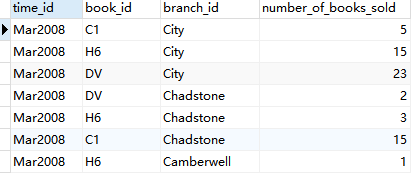

solution2: 

```sql
-- BOOK_PRICE_DIM (TEMPORAL DIMENSION)
create table BOOK_PRICE_DIM as select distinct * from BOOK_PRICE_HISTORY;
select * from BOOK_PRICE_DIM;

-- BOOK SALES REPORT 2 (CORRECT PRICE REPORT)
select F.TIME_ID as "Month", F.BRANCH_ID as "Branch", F.BOOK_ID as "Book ID",
B.BOOK_TITLE as "Book Title", B.AUTHOR, BP.PRICE,
F.NUMBER_OF_BOOKS_SOLD as "No of Books Sold"
from BOOK_SALES_FACT1 F, BOOK_PRICE_DIM BP, BOOK_DIM B
where F.BOOK_ID = B.BOOK_ID
and BP.BOOK_ID = B.BOOK_ID
and to_date(F.TIME_ID, 'MonYYYY') >= to_date(BP.START_DATE, 'MonYYYY')
and to_date(F.TIME_ID, 'MonYYYY') <= case BP.END_DATE when 'Now' then now()
else to_date(BP.END_DATE, 'MonYYYY')
end
order by F.TIME_ID desc, F.BRANCH_ID desc, F.NUMBER_OF_BOOKS_SOLD asc;

--add a new Fact: Total Sales
create table BOOK_SALES_FACT2 as
select to_char(T.TRANSACTION_DATE, 'MonYYYY') as TIME_ID, BK.BOOK_ID, BR.BRANCH_ID,
sum(T.QUANTITY) as NUMBER_OF_BOOKS_SOLD,
sum(T.QUANTITY * BP.PRICE) as TOTAL_SALES
from BOOK_TRANSACTION T, BOOK BK, BRANCH BR, BOOK_PRICE_HISTORY BP
where T.BRANCH_ID = BR.BRANCH_ID
and T.BOOK_ID = BK.BOOK_ID
and BK.BOOK_ID = BP.BOOK_ID
and T.TRANSACTION_DATE >= to_date(BP.START_DATE, 'MonYYYY')
and T.TRANSACTION_DATE <= case BP.END_DATE when 'Now' then now()
else to_date(BP.END_DATE, 'MonYYYY')
end
group by to_char(T.TRANSACTION_DATE, 'MonYYYY'), BK.BOOK_ID, BR.BRANCH_ID;
select * from BOOK_SALES_FACT2;
```


## OLAP

1.CUBE
Extension to the GROUP BY clause to generate information in cross-tabulation format within a single query.
CUBE gets input in a form of a set of attribute names to be grouped and it will produce subtotals for all the possible combinations of the specified attributes and the grand total.

2.ROLLUP
Extension to the GROUP BY clause to generate aggregations at increasing levels of granularity from the most detailed to a grand total.
ROLLUP gets input in a form of a set of attribute names to be grouped and produces subtotals of rolling-up aggregate combinations of the specified attributes and the grand total.
The difference with CUBE is that in ROLLUP only rolling up aggregates are included, not all possible combinations (refer to example in the next slide).

3.GROUPING
To be used in conjunction with SELECT statement to display information about the aggregate levels and the relevant subtotals for each aggresgate level.

DECODE can be used to display appropriate titles for the subtotals

▪It is important to differentiate the aggregate NULL values that appear in the output when using CUBE or ROLLUP as opposed to the ‘null’ values when data is not recorded. In the result of CUBE or ROLLUP, the NULL values represent All aggregate combinations.
▪ GROUPING clause displays information about which rows are subtotal and for which level of aggregation. It also shows the difference between subtotal values and ‘null’ values.
▪ GROUPING appears in the SELECT statement list.

4.Partial Cube and Partial Rollup

Partial ROLLUP
Rollup to include only some of the subtotals
` GROUP BY expr1, ROLLUP (expr2, expr3) `
• First-level subtotals aggregating across expr3 for each combination of expr2 and expr1
• Second-level subtotals aggregating across expr2 and expr3 for each expr1 value
• No grand total aggregating across all expr1, expr2, expr3

Partial CUBE
Partial CUBE resembles partial ROLLUP in that you can limit it to certain dimensions and precede it with columns outside the CUBE operator.
In this case, subtotals of all possible combinations are limited to the dimensions within the cube list (in parentheses), and they are combined with the preceding items in the GROUPBY list.
` GROUP BY expr1, CUBE (expr2, expr3) `

RANK
Computes the rank of a record compared to other records in the dataset based on the values of a set of measures, for example finding the top three items sold last year.
The difference between RANK and DENSE_RANK is that DENSE_RANK leaves no gaps in ranking sequence when there are ties.

```
Syntax:
RANK( ) OVER ([query_partition_clause] order_by_clause)
DENSE_RANK( ) OVER ([query_partition_clause] order_by_clause)
```

Row Number
The ROW_NUMBER function assigns a unique number (sequentially, starting from 1, as defined by ORDER BY) to each row within the partition.

```
ROW_NUMBER() OVER
([query_partition_clause] order_by_clause)
```

ROW_ NUMBER is a non-deterministic function, so each tied value could have its row number switched. To ensure deterministic results, you must order on a unique key.

RANK and DENSE RANK
Computes the ranking of a record, and the rank of the record is an integer. The top rank record is rank 1, the second is rank 2, etc. For example, find the top 3 items sold last year (e.g. rank 1, rank 2, and rank 3).
PERCENT RANK
Also computes the ranking of a record, but in a percentage form. For example, find the top 5% items sold last year.

Cumulative and Moving Aggregates

Cumulative Aggregate
Calculate cumulative values within each window partition.
Moving Aggregate
Calculate moving aggregate values within each window partition.

Summary – OLAP
▪ The OLAP queries:
a) Basic aggregate functions: count, sum, avg, max, and min. The group by clause is often used in conjunction with these basic aggregate functions.
b) Cube and Rollup: group by cube, and group by rollup. Simple formatting of the query results can be enhanced thru decode and grouping functions.
c) Ranking and Partition: rank() over and dense_rank() over functions. The row_number() over function has some similarities (as well as differences) to the ranking functions. The partition clause in the ranking function can be used to partition dataset; each with its own ranking.
d) Top-N and Top-Percentage Ranking: use of nested queries to retrieve Top-N, and percent_rank function to retrieve Top-Percentage rankings.
e) Cumulative and Moving Aggregate: row unbounded preceding or row n proceeding can be used to get the cumulative or moving aggregate values.

### Example

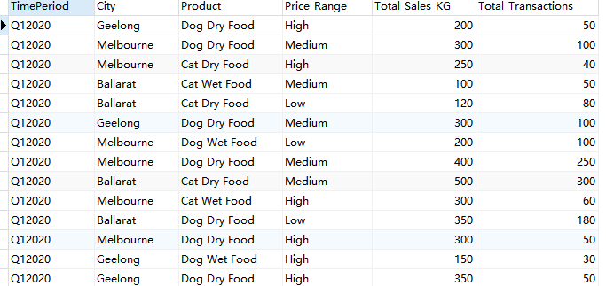

```sql
---olap case for pet_table--
DROP TABLE IF EXISTS pet_fact;
CREATE TABLE pet_fact (
  TimePeriod varchar(255),
  City varchar(255),
  Product varchar(255),
  Price_Range varchar(255),
  Total_Sales_KG int,
  Total_Transactions int
);

INSERT INTO "pet_fact" VALUES ('Q12020', 'Geelong', 'Dog Dry Food', 'High', 200, 50); 
INSERT INTO "pet_fact" VALUES ('Q12020', 'Melbourne', 'Dog Dry Food', 'Medium', 300, 100);
INSERT INTO "pet_fact" VALUES ('Q12020', 'Melbourne', 'Cat Dry Food', 'High', 250, 40);
INSERT INTO "pet_fact" VALUES ('Q12020', 'Ballarat', 'Cat Wet Food', 'Medium', 100, 50);
INSERT INTO "pet_fact" VALUES ('Q12020', 'Ballarat', 'Cat Dry Food', 'Low', 120, 80);   
INSERT INTO "pet_fact" VALUES ('Q12020', 'Geelong', 'Dog Dry Food', 'Medium', 300, 100);  
INSERT INTO "pet_fact" VALUES ('Q12020', 'Melbourne', 'Dog Wet Food', 'Low', 200, 100);  
INSERT INTO "pet_fact" VALUES ('Q22020', 'Melbourne', 'Dog Dry Food', 'Medium', 400, 250);
INSERT INTO "pet_fact" VALUES ('Q22020', 'Ballarat', 'Cat Dry Food', 'Medium', 500, 300);
INSERT INTO "pet_fact" VALUES ('Q22020', 'Melbourne', 'Cat Wet Food', 'High', 300, 60); 
INSERT INTO "pet_fact" VALUES ('Q22020', 'Ballarat', 'Dog Dry Food', 'Low', 350, 180);
INSERT INTO "pet_fact" VALUES ('Q22020', 'Melbourne', 'Dog Dry Food', 'High', 300, 50);
INSERT INTO "pet_fact" VALUES ('Q22020', 'Geelong', 'Dog Wet Food', 'High', 150, 30);
INSERT INTO "pet_fact" VALUES ('Q22020', 'Geelong', 'Dog Dry Food', 'High', 350, 50);   


--cleaning
select * from pet_fact group by timeperiod,city,product,price_range,total_sales_kg,total_transactions having count(*)>1;
select *,count(*) from pet_fact group by timeperiod,city,product,price_range,total_sales_kg,total_transactions having count(*)>1;

--1 rollup
select timeperiod,city,product,avg(total_sales_kg) as average_total_sales_kg
from pet_fact
where product like '%Dog%'
group by rollup(timeperiod,city,product) order by timeperiod,city;

--2 cube
select case when grouping(product)=1 then 'All Products' else product end as product,
       case when grouping(city)=1 then 'All Cities' else city end as city,
sum(total_transactions) as total_transactions
from pet_fact 
group by cube(city,product) order by product,city;
-- cube oracle decode
select decode(grouping(f.product),1,'All Products',f.product) as product,                 decode(grouping(f.city),1,'All Cities',f.city) as city,
sum(f.total_transactions) as total_transactions
from pet_fact f
group by cube(f.city,f.product);

--3 rank() over (partition by .. order by..)
select * from
(
select city,product, sum(total_sales_kg) as total_sales,
rank() over (partition by city order by sum(total_transactions) desc) as rank
from pet_fact 
group by city,product) as t
where rank<=2
;

--4 cumulative olap
---sum (sum ()) over (order by ... rows unbounded preceding)
select timeperiod, city, sum(total_transactions) as "total transactions",
sum(sum(total_transactions)) over
 ( order by timeperiod, city rows UNBOUNDED PRECEDING) as "cumulative transactions"
from pet_fact 
group by timeperiod, city;
```


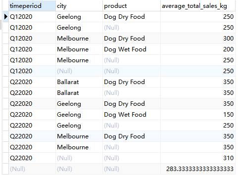

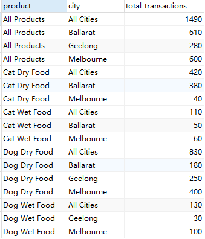

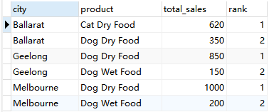

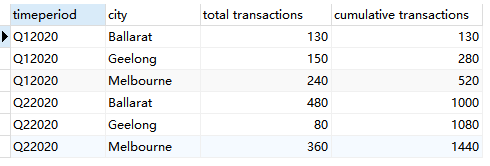


Example

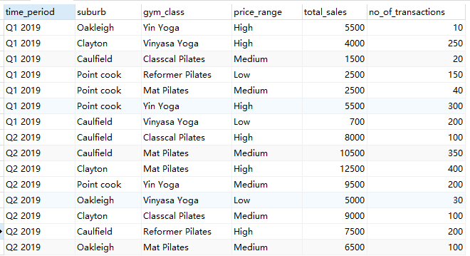

```sql
--
DROP TABLE IF EXISTS gym_fact;
CREATE TABLE "public"."gym_fact" (
  Time_PERIOD varchar(255),
  SUBURB varchar(255),
  GYM_CLASS varchar(255),
  PRICE_RANGE varchar(255),
  TOTAL_SALES numeric(255),
  NO_OF_TRANSACTIONS numeric(255)
);

INSERT INTO gym_fact VALUES ('Q1 2019', 'Oakleigh', 'Yin Yoga', 'High', 5500, 10);
INSERT INTO gym_fact VALUES ('Q1 2019', 'Clayton', 'Vinyasa Yoga', 'High', 4000, 250);
INSERT INTO gym_fact VALUES ('Q1 2019', 'Caulfield', 'Classcal Pilates', 'Medium', 1500, 20);
INSERT INTO gym_fact VALUES ('Q1 2019', 'Point cook', 'Reformer Pilates', 'Low', 2500, 150);
INSERT INTO gym_fact VALUES ('Q1 2019', 'Point cook', 'Mat Pilates', 'Medium', 2500, 40);
INSERT INTO gym_fact VALUES ('Q1 2019', 'Point cook', 'Yin Yoga', 'High', 5500, 300);
INSERT INTO gym_fact VALUES ('Q1 2019', 'Caulfield', 'Vinyasa Yoga', 'Low', 700, 200);
INSERT INTO gym_fact VALUES ('Q2 2019', 'Caulfield', 'Classcal Pilates', 'High', 8000, 100);
INSERT INTO gym_fact VALUES ('Q2 2019', 'Caulfield', 'Mat Pilates', 'Medium', 10500, 350);
INSERT INTO gym_fact VALUES ('Q2 2019', 'Clayton', 'Mat Pilates', 'High', 12500, 400);
INSERT INTO gym_fact VALUES ('Q2 2019', 'Point cook', 'Yin Yoga', 'Medium', 9500, 200);
INSERT INTO gym_fact VALUES ('Q2 2019', 'Oakleigh', 'Vinyasa Yoga', 'Low', 5000, 30);
INSERT INTO gym_fact VALUES ('Q2 2019', 'Clayton', 'Classcal Pilates', 'Medium', 9000, 100);
INSERT INTO gym_fact VALUES ('Q2 2019', 'Caulfield', 'Reformer Pilates', 'High', 7500, 200);
INSERT INTO gym_fact VALUES ('Q2 2019', 'Oakleigh', 'Mat Pilates', 'Medium', 6500, 100);


--rollup
select time_period,suburb,gym_class,avg(total_sales) as average_sales_total
from gym_fact
where gym_class like '%Vin%' or gym_class like '%Yin%'
group by rollup(time_period,suburb,gym_class) order by time_period asc;

--rollup
select case when grouping(g.gym_class)=1 then 'All Gym Classes' else g.gym_class end as gym_class,
case when grouping(g.suburb)=1 then 'All Suburbss' else g.suburb end as suburb,   
case when grouping(g.price_range)=1 then 'All Price Range' else g.price_range end as price_range,
sum(g.no_of_transactions) as number_of_transactions
from gym_fact g
group by rollup(g.gym_class,g.suburb,g.price_range) order by gym_class desc,suburb, price_range asc;


--rank() over (patition by ... order by ...) as ...
select * from
(
select suburb,gym_class, sum(total_sales) as total_sales,
rank() over (partition by suburb order by sum(total_sales) desc) as rank
from gym_fact 
group by suburb,gym_class) as t
where rank<=2 order by suburb,total_sales
;

--moving_avg
--avg(sum(attr)) over (order by ... rows 1 preceding) as ...
select time_period, suburb, sum(no_of_transactions) as "total_transactions",
avg(sum(no_of_transactions)) over
 ( order by time_period, suburb rows 1 PRECEDING) as "moving_average_transactions"
from gym_fact 
group by time_period, suburb;
```


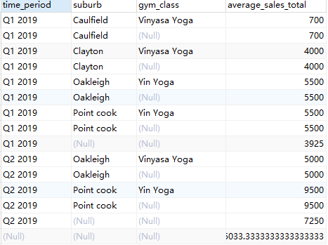

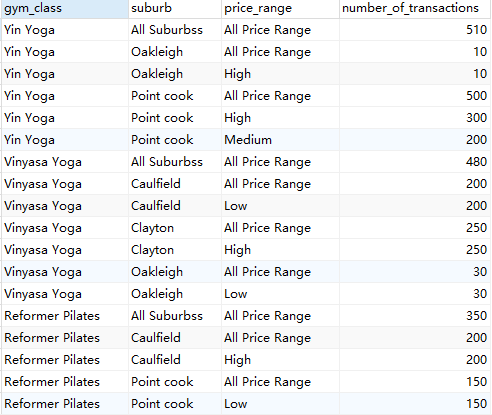

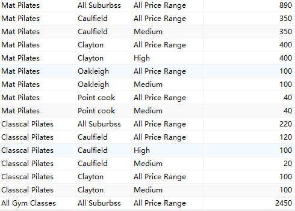


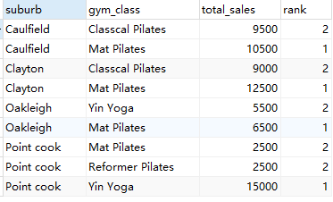

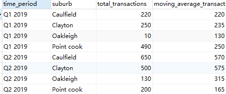


### Level of Aggregations

Level of granularity:
▪ The highest granularity star schema, which contains the most detail data is Level-0.
▪ Level-1 star schemas have a lower granularity of the fact measure (e.g. less detail data, as the data is already aggregated).
▪ Level-2 star schemas are built on top of Level-1 star schemas, and have even a lower granularity of the fact measures.

Level of aggregation:
▪ Level-0 – has the highest level of granularity where no aggregation exists. Level-0 star schema is almost identical
to the E/R diagram.
▪ Level-1 – medium level of aggregation by incorporating ALL domain tables from the operation database but may still
incorporate some user-defined groupings.
▪ Level-2 – high level of aggregation by (i) incorporating selected dimension tables only based on specifications, and
(ii) incorporating user-defined grouping for time, distance. etc (e.g. yearly/monthly only, short/med/long distance only)

Level of Aggregations
▪ The lower the level of granularity, the higher the level of aggregations.
▪ There is no particular rule about determining the level of aggregations (with an exception that
Level-0 always means no aggregation).

Two ways to lower down the level of aggregations of a star schema:

1. Add a new dimension. When we add a new dimension, each value in the
   fact measure will literally be broken down more details on each record of
   the new dimension.
2. Replace an existing dimension with a higher granularity dimension. The
   values of the fact measures will also be broken down more details
   because the fact measure has a lower detail dimension.

Level of Aggregations
▪ Level-0 star schema provides the most detailed information about the data warehouse.
▪ The upper levels provide some levels of aggregated information, which has a higher level of aggregation.
➢ Level (x+1) star schema is more aggregated than level x star schema.
▪ There is no particular guideline on how many levels we should have in the data warehousing architecture. It can be less or more than three, depending on how many level of aggregation is needed.
▪ There is no particular rule on what kind of aggregation a star schema needs on a particular level (except that Level-0 must not have any aggregation).

Facts without Fact Measure
▪ When designing a data warehousing architecture, we can start designing from
a higher level of aggregation.
▪ Lowering down the level of aggregation can be done either by adding a new
dimension to the star schema, or by changing the level of granularity of an
existing dimension.
▪ There is a second method for designing a data warehousing architecture, that
is by starting from Level-0 (by converting an E/R diagram into a star schema
structure, which is an n-ary relationship between all dimensions and the fact).
▪ To move up a level in the data warehousing architecture, the opposite method
is applied: changing the level of granularity of a dimension, or removing an
existing dimension.

# XML

```
XML information
version  (must have)
encoding (optional – default: UTF-8)
standalone (optional)
DOCTYPE (optional)
Can include
DTD (Document Type Declarations) - internal DTD
Reference information for external DTD

Enclosing tags
	<?xml...?>
Contents Example
	<?xml version="1.0" encoding="UTF-8" standalone="no" ?>
encoding-->tells parser how to decode document
standalone-->indicates whether the definitions for tags are internal or external

All documents must have a root element
All elements which have an opening tag must have a closing tag 
Tags are case sensitive
All elements must be properly nested
Attribute values must always be quoted
Use entity references for special characters in data
Comments are enclosed in by <!-- and --> 
White space is preserved
A new line is stored as LF (line feed)
```


```
xpath

xquery
```


# Big Data


```
HBase is a column-oriented NoSQL distributed database that sits as a layer on top of HDFS. HBase is based on Google's BigTable and is optimized for random reads and writes on very large data tables. You read only the columns you need, which are grouped together in "column families". HBase does not , support secondary indexes, stored procedures or query languages such as SQL, or ACID transactions.

Cassandra is also a fault-tolerant column-oriented distributed. Like HBase, Cassandra uses Google's Big Table column-oriented data model. Cassandra can be layered on Hadoop, but it is most frequently run on Amazon's DynamoDB. Cassandra also supports Pig and Hive, but may not support everything that Hadoop does.

Hive is a data warehouse system that allows ad-hoc queries and analysis of large datasets. Hive uses a SQL-like language called HiveQL and stores its metadata in a relational database called "Derby." Because HBase and Cassandra lack their own versions of SQL, they are sometimes integrated with Hive to take advantage of Hive's version of SQL. Tables in Hive can be either internal or external. Internal tables are managed by Hive in its own warehouse directory. They can be used if the data is entirely created, maintained and deleted within Hive, but Hive also runs on HDFS files, which would be external to Hive. Hive will use MapReduce to process its queries if necessary.
Hive does not provide indexing capability, or the ability to modify records.

Pig is a high-level imperative data query language that uses a number of steps instead of the descriptions of declarative languages such as SQL. Pig can work with any kind of data. It doesn't require a fixed schema. Instead it creates its own schema, based on the modules used to create it, and casts any field to null that doesn't fit into its derived schema, so the data doesn't have to all have the same structure. Pig is often used in ETL (Extraction, Transform and Load) processes.
Mahout is a library with machine-learning algorithms that can be used with Hadoop's MapReduce, which gives it the ability to run on very large datasets. The library includes algorithms for clustering, classification and recommenders.

Sqoop is a set of tools to import or export relational database data into Hadoop through a JDBC connection string. It supports any database that is supported by JDBC. Tools within Sqoop will import a database table into HDFS or export an HDFS directory to a relational database table, etc. Sqoop also works with Hive.

Zookeeper is a centralized service that coordinates the configuration of distributed systems. With distributed transactions there are many possible sources of error. To ensure that a transaction was successful takes some work for the programmer. Zookeeper works at that level to ensure that the jobs complete, or notifies the user when they don't.
```


## Spark


# 

```
http://github.com/apache/spark
SparkContext
SparkConf

1）数据的存储：切割 HDFS的Block
2）数据的计算：切割（分布式计算）MapReduce/Spark
3) 存储+计算：HDFS、S3+MapReduce/Spark

RDD: Resilient Distributed Dataset 弹性分布式数据集
immutable 不可变
partitioned collection of elements 分区
can be operated on in parallel 并行处理

RDD的特性
RDD is characterized by five main properties:
 *  - A list of partitions
 *  - A function for computing each split(partition) ## y=f(x) rdd.map(_+1)
 *  - A list of dependencies on other RDDs ## rdd1=>rdd2=>rdd3=>rdd4
 *  - Optionally, a Partitioner for key-value RDDs (e.g. to say that the RDD is hash-partitioned)
 *  - Optionally, a list of preferred locations to compute each split on (e.g. block locations for
 *    an HDFS file) ## 数据在哪优先把作业调度到数据所在的节点进行计算：移动数据不如移动计算
 
   @DeveloperApi
  def compute(split: Partition, context: TaskContext): Iterator[T]
```


```
RDD Operation:
transformations: create a new dataset from an existing one. [转换]
lazy, nothing actually happens until an action is called. action triggers the computation.
- rdd.map().filter()...collect
actions: return a value to the driver program after running a computation on the dataset. [动作]
action returns values to driver or writes data to external storage.
- reduce: an action that aggregates all the elements of the RDD using some function and returns the final result to the driver program
rdd.count/ reduce/ collect


RDD常用Transformation 算子编程
- map(func): 将func函数作用到数据集的每一个元素上，生辰过一个新的分布式数据集返回
- filter(func): 选出所有func返回值为true的元素，生成一个新的分布式数据集返回
- flatMap(func): 输入的item能够被map到0或者多个items输出，返回值是一个Sequence
- groupByKey(): 把相同的key的数据分发到一起
- reduceByKey(): 把相同的key的数据分发到一起，并进行相应的计算
rdd.reduceByKey(lambda x, y: x+y)
[1,1] =>1+1
[1,1,1] =>1+1=2+1=3
- sortByKey(): 
- union(): 
- distinct():
- join(): left /right/

RDD常用Action 算子编程
collect()
count()
take()
max()
min()
foreach()
saveAsTextFile()


案例
- 词频统计:wc
	1) input: 文件，文件夹，后缀
	2) 步骤：
	文本内容的每一行转成一个个单词；flatMap
	单词==>(单词,1)：map
	把所有相同单词的计数相加得到最终结果：reduceByKey
- TopN：
	1) input：文件，文件夹，后缀
	2) 求某个维度的topN
	3) 步骤
	文本内容的每一行根据需求提取出需要的字段：map
	单词==>(单词,1)：map
	把所有相同单词的计数相加得到最终结果：reduceByKey
	取最多出现次数的降序: sortByKey
	
- 平均数：

```


```
Spark 核心概念

Application： 基于Spark的应用程序=1 driver+executors
	User program built on Spark. Consists of a driver program and executors on the cluster.
	eg. spark-shell; xxx.py
Driver program:
	The process running the main() function of the application and creating the SparkContext
Cluster manager:
	An external service for acquiring resources on the cluster (e.g. standalone manager, Mesos, YARN, Kubernetes)
	-- master local[2]/spark://localhost:7077/yarn
Deploy mode:
	Distinguishes where the driver process runs. In "cluster" mode, the framework launches the driver inside of the 	cluster. In "client" mode, the submitter launches the driver outside of the cluster.
Worker node:
	Any node that can run application code in the cluster
	standalone: slave节点 slaves配置文件
	yarn: nodemanager
Executor:
	A process launched for an application on a worker node, that runs tasks and keeps data in memory or disk 		storage across them. Each application has its own executors.
Task:
	A unit of work that will be sent to one executor
Job:
	A parallel computation consisting of multiple tasks that gets spawned in response to a Spark action (e.g. save, 	collect); you'll see this term used in the driver's logs.
	一个action对应一个job
Stage:
	Each job gets divided into smaller sets of tasks called stages that depend on each other (similar to the map 	and reduce stages in MapReduce); you'll see this term used in the driver's logs.
```


# Python


# Linux


```
root:x:0:0:root:/root:/bin/bash
```


# Git

```shell
git config
git config --global -l
# 配置用户名及邮箱
git config --global user.name "username"
git config --global user.email ""

git config --local -l
git config --system -l
# 初始化版本库
git init
# 添加至暂存区
git add
git add .

# 提交
git commit 
git commit -m "msg"

# 查看当前版本状态
git status

# 查看本地分支
git branch

# 查看远程分支
git branch -r

git pull

# 推送到远程
git push 
git push -u origin master
git push -u -f origin master

git checkout -b v1.0 origin/master


# 远程仓库
git remote rm origin
git remote add origin [url]
git remote set-url origin [url]
git remote set-url origin https://github.com/x/x.git

## 查看提交历史记录
git log
git log --color --graph
```


# MongoDB

在Ubuntu18.04上安装MongoDB

```
tar -zxvf mongodb-linux-x86_64-ubuntu1604-4.2.7.tgz
mv mongodb-linux-x86_64-ubuntu1604-4.2.7/ /usr/local/mongodb


./mongod: error while loading shared libraries: libcurl.so.4: cannot open shared object file: No such file or directory
./mongod: /usr/lib/x86_64-linux-gnu/libcurl.so.4: version `CURL_OPENSSL_3' not found (required by ./mongod)

#安装libcurl
apt-get install libcurl4-openssl-dev
apt-get install 


#配置

#启动MongoDB
cd /usr/local/mongodb/bin
./mongod -dbpath ../data -port 4000

#打开MongoDB shell
./mongo -port 4000
```


```
#使用
> db
test
#显示所有数据库库列表
> show dbs
admin   0.000GB
config  0.000GB
local   0.000GB

#连接到指定的数据库
> use local
switched to db local

#创建数据库,如果数据库不存在，则创建数据库，否则切换到指定数据库
use DATABASE_NAME

#删除数据库
#首先切换到指定数据库
#执行删除命令
> db.dropDatabase()
#删除集合
> db.collection.drop()
#创建集合
> db.createCollection(NAME,OPTIONS)

#插入文档
> db.COLLECTION_NAME.insert(document)


```

## DDL

```
#Removing all documents from a collection
db.mycol.remove({})
#Dropping a collection
db.mycol.drop()
#Dropping a database
db.dropDatabase()
```

## DML

```
insert
load


e.g.
db.department.find({"address.city":"Wollongong"})
db.department.find({"courses.credits":{"$lt":6}})
```


## Aggregations(聚合)

```
$project #投影，类似SELECT子句
$match #过滤，类似find()，WHERE子句
$limit #限制要传递到下一个文档的总数操作（类似于LIMIT子句，rownum条件）
$skip #跳过给定的指定数量的文档
$unwind #扩展（嵌套）一个数组，为每个数组条目生成一个输出文档
$group #按指定键对文档进行分组（GROUP BY子句）
$sort #对文档进行排序（ORDER BY子句）
$out #将结果从管道保存到集合
$count #计算管道中的文档总数
```


# 哈哈

## haha1

```java
db.orders.insert ( {"_id":"Zaanse Snoepfabriek","SUPPLIER": { "company name":"Zaanse Snoepfabriek", "contact name":"Dirk Luchte", "contact title":"Accounting Manager", "address":"VerkoopRijnweg 22", "city":"Zaandam", "region":null, "postal code":"9999 ZZ", "country":"Netherlands", "phone":"(12345) 1212", "fax":"(12345) 1210", "home page":null, "supplies":[{"PRODUCT":{"product name":"Zaanse koeken","category name":"Confections","quantity per unit":"10 - 4 oz boxes","unit price":9.5,"units in stock":NumberInt("36"),"units on order":NumberInt("0"),"reorder level":NumberInt("0"),"discontinued":"N"} },{"PRODUCT":{"product name":"Chocolade","category name":"Confections","quantity per unit":"10 pkgs.","unit price":12.75,"units in stock":NumberInt("15"),"units on order":NumberInt("70"),"reorder level":NumberInt("25"),"discontinued":"N"} }]} } );

db.orders.insert ( {"SUPPLIER": { "city":"Zaandam", "supplies":[{"PRODUCT":{"product name":"Changde Noodles","category name":"Noodles" }]} } );

```


```
db.orders.find({"CUSTOMER.submits.ORDER.order id":325}).pretty();
db.orders.find({"SUPPLIER.supplies.PRODUCT.category name":"Confections"});
db.orders.find({" "})
```

```
Append a new product Changde Noodles that belongs to a category Noodles
to a list of products supplies by a supplier located in a city Zaandam. All other
information is unknown at the moment. Display the names of products supplied by a
supplier located in a city Zaandam.

db.orders.update({
"_id":"Zaanse Snoepfabriek",
{
"SUPPLIER": { 
	"company name":"Zaanse Snoepfabriek",
    "contact name":"Dirk Luchte", 
    "contact title":"Accounting Manager",
    "address":"VerkoopRijnweg 22", 
    "city":"Zaandam", "region":null,
    "postal code":"9999 ZZ",
    "country":"Netherlands", 
    "phone":"(12345) 1212", 
    "fax":"(12345) 1210", 
    "home page":null
  },{$push:{"supplies":{"PRODUCT":{"product name":"Changde Noodles","category name":"Noodles","quantity per unit":null,"unit price":null,"units in stock":null,"units on order":null,"reorder level":null,"discontinued":null} }
   	}
   	}
});


db.orders.update({
"_id":"Zaanse Snoepfabriek"
},
{$push:{
"SUPPLIER": { 
	"company name":"Zaanse Snoepfabriek",
    "contact name":"Dirk Luchte", 
    "contact title":"Accounting Manager",
    "address":"VerkoopRijnweg 22", 
    "city":"Zaandam", "region":null,
    "postal code":"9999 ZZ",
    "country":"Netherlands", 
    "phone":"(12345) 1212", 
    "fax":"(12345) 1210", 
    "home page":null,
    "supplies":{"PRODUCT":{"product name":"Changde Noodles","category name":"Noodles","quantity per unit":null,"unit price":null,"units in stock":null,"units on order":null,"reorder level":null,"discontinued":null} }
   	}}
   	}
);


db.orders.update({
"_id":"Zaanse Snoepfabriek"
},
{$push:{
"SUPPLIER.supplies":{"PRODUCT":{"product name":"Changde Noodles","category name":"Noodles","quantity per unit":null,"unit price":null,"units in stock":null,"units on order":null,"reorder level":null,"discontinued":null} }
   	}
   	}
);
db.orders.find({"SUPPLIER.city":"Zaandam"},{"SUPPLIER.supplies.PRODUCT.product name":1,"_id":0}).pretty();
db.orders.find({"SUPPLIER.city":"Zaandam"}).pretty();
----------------------

db.orders.insert ( {"_id":"Tokyo Traders","SUPPLIER": { "company name":"Tokyo Traders", "contact name":"Yoshi Nagase", "contact title":"Marketing Manager", "address":"9-8 SekimaiMusashino-shi", "city":"Tokyo", "region":null, "postal code":"100", "country":"Japan", "phone":"(03) 3555-5011", "fax":null, "home page":null, "supplies":[{"PRODUCT":{"product name":"Mishi Kobe Niku","category name":"Meat/Poultry","quantity per unit":"18 - 500 g pkgs.","unit price":97,"units in stock":NumberInt("29"),"units on order":NumberInt("0"),"reorder level":NumberInt("0"),"discontinued":"Y"} },{"PRODUCT":{"product name":"Ikura","category name":"Seafood","quantity per unit":"12 - 200 ml jars","unit price":31,"units in stock":NumberInt("31"),"units on order":NumberInt("0"),"reorder level":NumberInt("0"),"discontinued":"N"} },{"PRODUCT":{"product name":"Longlife Tofu","category name":"Produce","quantity per unit":"5 kg pkg.","unit price":10,"units in stock":NumberInt("4"),"units on order":NumberInt("20"),"reorder level":NumberInt("5"),"discontinued":"N"} }]} } );

Remove information about a product Longlife Tofu supplied by a supplier
Tokyo Traders. Display the names of products supplied by a supplier Tokyo
Traders.

#删除数组元素

db.orders.update({
"_id":"Tokyo Traders"
},
{
$pull:{
	"SUPPLIER.supplies":{"PRODUCT":{"product name":"Longlife Tofu"} }
  }
 }
);
db.orders.find({"_id":"Tokyo Traders"},{"SUPPLIER.supplies.PRODUCT.product name":1,"_id":0}).pretty();

---
Increase a unit price of a product Flotemysost by 100%. Display the
product name and the changed unit price in a pretty format.
db.orders.find({"SUPPLIER.supplies.PRODUCT.product name":"Flotemysost"}).forEach(
   function(item){                
       db.orders.update({"_id":item._id},{$set:{"SUPPLIER.supplies.PRODUCT.unit price":"item.SUPPLIER.supplies.PRODUCT.unit price"*2}},false,true)
   }
);
db.orders.find({"SUPPLIER.supplies.PRODUCT.product name":"Flotemysost"}).pretty();
db.orders.find({"SUPPLIER.supplies.PRODUCT.product name":"Flotemysost"},{"SUPPLIER.supplies.PRODUCT.product name":1,"SUPPLIER.supplies.PRODUCT.unit price":1,"_id":0}).pretty();
---
db.orders.insert ( {"_id":"FAMIA","CUSTOMER": { "customer code":"FAMIA", "company name":"Familia Arquibaldo", "contact name":"Aria Cruz", "contact title":"Marketing Assistant", "address":"Rua Oros, 92", "city":"São Paulo", "region":"SP", "postal code":"05442-030", "country":"Brazil", "phone":"(11) 555-9857", "fax":null, "submits":[{"ORDER":{"order id":NumberInt("328"),"employee id":NumberInt("9"),"order date":new Date("1996-12-18"),"required date":new Date("1997-01-01"),"shipped date":new Date("1996-12-25"),"ship via":"Federal Shipping","freight":13.99,"ship name":"Familia Arquibaldo","ship address":"Rua Orós, 92","ship city":"São Paulo","ship region":"SP","ship postal code":"05442-030","ship country":"Brazil","consists of":[{"ORDER DETAIL":{"product name":"Louisiana Fiery Hot Pepper Sauce","unit price":16.8,"quantity":NumberInt("40"),"discount":0} },{"ORDER DETAIL":{"product name":"Raclette Courdavault","unit price":44,"quantity":NumberInt("9"),"discount":0} },{"ORDER DETAIL":{"product name":"Scottish Longbreads","unit price":10,"quantity":NumberInt("10"),"discount":0} }]} },{"ORDER":{"order id":NumberInt("356"),"employee id":NumberInt("2"),"order date":new Date("1997-01-14"),"required date":new Date("1997-02-11"),"shipped date":new Date("1997-01-17"),"ship via":"Federal Shipping","freight":21.48,"ship name":"Familia Arquibaldo","ship address":"Rua Orós, 92","ship city":"São Paulo","ship region":"SP","ship postal code":"05442-030","ship country":"Brazil","consists of":[{"ORDER DETAIL":{"product name":"Filo Mix","unit price":5.6,"quantity":NumberInt("20"),"discount":0} }]} }]} } );

Rename a key submits to a key sends in the orders submitted by a customer
FAMIA. Display all information about a customer FAMIA.

db.orders.CUSTOMER.update({},{"$rename":{"submits":"sends"}},false,true);

db.orders.update({},{"$rename":{"CUSTOMER.submits":"CUSTOMER.sends"}},false,true);
db.fight.skill.update({},{"$rename":{"combatSkillId":"skillId"}},false,true)
db.orders.find({"_id":"FAMIA"},{"_id":0}).pretty();
---
An order with order_id equal to 310 is now handled by an employee with
employee id equal to 7. Update the database. After update display order_id
and employee id in a pretty format.

var val="CUSTOMER.submits.ORDER.order id";
db.orders.find({"CUSTOMER.submits.ORDER.order id":NumberInt("310")}).forEach(
   function(item){
       db.orders.update({"CUSTOMER.submits.ORDER.order id":item.val},{$set:{"CUSTOMER.submits.ORDER.employee id":7)}});
   }
);

db.orders.find({"CUSTOMER.submits.ORDER.order id":NumberInt("310")}).forEach(
   function(item){
       db.orders.update({"CUSTOMER.submits.ORDER.order id":"NumberInt("310")},{$set:{"CUSTOMER.submits.ORDER.employee id":7)}})
   }
);
db.orders.update({"CUSTOMER.submits.ORDER.order id":310},{$set:{"CUSTOMER.submits.ORDER.employee id":7}});
db.orders.update({"CUSTOMER.submits.ORDER.order id":310},{$set:{}});
db.orders.find({"CUSTOMER.submits.ORDER.order id":310},{"CUSTOMER.submits.ORDER.order id":1,"CUSTOMER.submits.ORDER.employee id":1,"_id":0}).pretty();

db.orders.find({"CUSTOMER.submits.ORDER.order id":310},{"CUSTOMER.submits.ORDER.order id":1,"CUSTOMER.submits.ORDER.employee id":1,"_id":0}).pretty();

```

## haha2

```
# 2
db.orders.insert ( {"_id":"Gai paturage","SUPPLIER": { "company name":"Gai paturage", "contact name":"Eliane Noz", "contact title":"Sales Representative", "address":"Bat. B3, rue des Alpes", "city":"Annecy", "region":null, "postal code":"74000", "country":"France", "phone":"38.76.98.06", "fax":"38.76.98.58", "home page":null, "supplies":[{"PRODUCT":{"product name":"Raclette Courdavault","category name":"Dairy Products","quantity per unit":"5 kg pkg.","unit price":55,"units in stock":NumberInt("79"),"units on order":NumberInt("0"),"reorder level":NumberInt("0"),"discontinued":"N"} },{"PRODUCT":{"product name":"Camembert Pierrot","category name":"Dairy Products","quantity per unit":"15 - 300 g rounds","unit price":34,"units in stock":NumberInt("19"),"units on order":NumberInt("0"),"reorder level":NumberInt("0"),"discontinued":"N"} }]} } );


/* (1) Save all information about the names of products suplied by a supplier Gai paturage into a collection products1. Display in a pretty format without document identifiers all documents in a collection products1. */;
db.orders.find({"_id":"Gai paturage"},{"_id":0}).forEach(function(x){
    db.products1.insert(x);
});

db.products1.find({},{"_id":0}).pretty();


/* (2) Save all information about the names of products supplied by a supplier Gai paturage into a collection products2 that consists of the documents like {"product name": a-name-of-product}. Display in a pretty format without document identifiers all documents in a collection products2. */;

db.orders.find({"_id":"Gai paturage"},{"SUPPLIER.supplies.PRODUCT.product name":1,"_id":0}).forEach(function(x){
	db.products2.insert(x);
});
db.products2.find({},{"_id":0}).pretty();

db2.product1.aggregate([
 {$project:{"SUPPLIER.supplies.PRODUCT.product name":1}}
]);
/* (3) Find the total number of products in a collection orders. Display a result in a format {"total number of products":integer-value}. */;

db.orders.aggregate([ {$project:{"total number of products":1,"_id":0}}]);

db.orders.aggregate([ {$group:{"_id":"$SUPPLIER.supplies.PRODUCT"}},
	{$count:"total number of products"}
]);


db.orders.insert ( {"_id":"WOLZA","CUSTOMER": { "customer code":"WOLZA", "company name":"Wolski  Zajazd", "contact name":"Zbyszek Piestrzeniewicz", "contact title":"Owner", "address":"ul. Filtrowa 68", "city":"Warszawa", "region":null, "postal code":"01-012", "country":"Poland", "phone":"(26) 642-7012", "fax":"(26) 642-7012", "submits":[{"ORDER":{"order id":NumberInt("316"),"employee id":NumberInt("1"),"order date":new Date("1996-12-05"),"required date":new Date("1997-01-02"),"shipped date":new Date("1996-12-09"),"ship via":"Federal Shipping","freight":3.94,"ship name":"Wolski Zajazd","ship address":"ul. Filtrowa 68","ship city":"Warszawa","ship region":null,"ship postal code":"01-012","ship country":"Poland","consists of":[{"ORDER DETAIL":{"product name":"Jack's New England Clam Chowder","unit price":7.7,"quantity":NumberInt("10"),"discount":0} },{"ORDER DETAIL":{"product name":"Tarte au sucre","unit price":39.4,"quantity":NumberInt("70"),"discount":0} }]} }]} } );


/* (4) List in the ascending order the ids of the first 3 employees who handled at least one order. Display the results in a format {"employee id":a-value-of employee-id}. List only distinct values. */;

db.orders.find({}).limit(3);

db.orders.aggregate([ {$group:{"_id":"$CUSTOMER.submits.ORDER.order id","handled more than one order":{$sum:1}}},
{$project:{"CUSTOMER.submits.ORDER.employee id":1,"_id":0}},
{$sort:{"CUSTOMER.submits.ORDER.employee id":1}},
]);

db.orders.aggregate([ {$group:{"_id":"$CUSTOMER.submits.ORDER.order id",
		"handled more than one order":{$sum:1}}},
	{$match:{$or:[{"handled more than one order":{$eq:1}},{"handled more than one order":{$gt:1}}]}},
	{$project:{"employee-id":"$CUSTOMER.submits.ORDER.employee id","_id":0}},
	{$sort:{"CUSTOMER.submits.ORDER.employee id":1}},
	{$limit:3}
]);
db.orders.aggregate([ {$group:{"_id":"$CUSTOMER.sends.ORDER.order id",
		"handled more than one order":{$sum:1}}},
	{$match:{$or:[{"handled more than one order":{$eq:1}},{"handled more than one order":{$gt:1}}]}},
	{$project:{"employee-id":"$CUSTOMER.sends.ORDER.employee id","_id":0}},
	{$sort:{"CUSTOMER.submits.ORDER.employee id":1}},
	{$limit:3}
]);
/* (5) Find the company names of suppliers together with the total number of supplied products by each company. Display the results in a format {"total products":integer-value,"company name":a-company-name}. */;
db.orders.aggregate([ {$group:{"_id":"$SUPPLIER.supplies.PRODUCT"}},
	{$count:"total-number-of-products"},
	{$$project:{"total products":"$total-number-of-products"},{"company name":"$SUPPLIER.company name"}}
]);
db.orders.aggregate([ {$group:{"_id":"$SUPPLIER.supplies.PRODUCT",
		"total-products":{$sum:1}}},
	{$project:{"total products":"$total-products"},{"company name":"$SUPPLIER.company name"}}
]);

db.orders.aggregate([ {$group:{"_id":"$SUPPLIER.supplies.PRODUCT",
		"total-products":{$sum:1}}}
]);
```


## haha3

```
#3

/* (1) Find the company name, contact name, and contact title of the customers with a given company name. */;
db.department.createIndex( {"budget":1}, {"unique":false} )
db.orders.insert ( {"_id":"Zaanse Snoepfabriek","SUPPLIER": { "company name":"Zaanse Snoepfabriek", "contact name":"Dirk Luchte", "contact title":"Accounting Manager", "address":"VerkoopRijnweg 22", "city":"Zaandam", "region":null, "postal code":"9999 ZZ", "country":"Netherlands", "phone":"(12345) 1212", "fax":"(12345) 1210", "home page":null, "supplies":[{"PRODUCT":{"product name":"Zaanse koeken","category name":"Confections","quantity per unit":"10 - 4 oz boxes","unit price":9.5,"units in stock":NumberInt("36"),"units on order":NumberInt("0"),"reorder level":NumberInt("0"),"discontinued":"N"} },{"PRODUCT":{"product name":"Chocolade","category name":"Confections","quantity per unit":"10 pkgs.","unit price":12.75,"units in stock":NumberInt("15"),"units on order":NumberInt("70"),"reorder level":NumberInt("25"),"discontinued":"N"} }]} } );

db.orders.createIndex( {"SUPPLIER.company name":1},{"unique":true});
db.orders.find({"SUPPLIER.company name":"Zaanse Snoepfabriek"},{"SUPPLIER.company name":1,"SUPPLIER.contact name":1,"SUPPLIER.contact title":1,"_id":0}).pretty();

/* (2) Find the company name of the customers who submitted an order with a give date. */;
db.orders.insert ( {"_id":"WOLZA","CUSTOMER": { "customer code":"WOLZA", "company name":"Wolski  Zajazd", "contact name":"Zbyszek Piestrzeniewicz", "contact title":"Owner", "address":"ul. Filtrowa 68", "city":"Warszawa", "region":null, "postal code":"01-012", "country":"Poland", "phone":"(26) 642-7012", "fax":"(26) 642-7012", "submits":[{"ORDER":{"order id":NumberInt("316"),"employee id":NumberInt("1"),"order date":new Date("1996-12-05"),"required date":new Date("1997-01-02"),"shipped date":new Date("1996-12-09"),"ship via":"Federal Shipping","freight":3.94,"ship name":"Wolski Zajazd","ship address":"ul. Filtrowa 68","ship city":"Warszawa","ship region":null,"ship postal code":"01-012","ship country":"Poland","consists of":[{"ORDER DETAIL":{"product name":"Jack's New England Clam Chowder","unit price":7.7,"quantity":NumberInt("10"),"discount":0} },{"ORDER DETAIL":{"product name":"Tarte au sucre","unit price":39.4,"quantity":NumberInt("70"),"discount":0} }]} }]} } );

db.orders.createIndex({"CUSTOMER.submits.ORDER.order date":1},{"unique":false});
db.orders.find({"CUSTOMER.submits.ORDER.order date":new Date("1996-12-05")},{"CUSTOMER.company name":1,"_id":0}).pretty();

/* (3) Find the names of products ordered by the customers living in a given city. */;

db.orders.createIndex({"CUSTOMER.city":1},{"unique":false});
db.orders.find({"CUSTOMER.city":"Warszawa"},{"CUSTOMER.city":1,"CUSTOMER.submits.ORDER.consists of.ORDER DETAIL.product name":1,"_id":0}).pretty();

/* (4) Find the names of countries the customers live in. */;
db.orders.createIndex({"CUSTOMER.country":1},{"unique":false});
db.orders.createIndex({"CUSTOMER.customer code":1},{"unique":false});
db.orders.find({"CUSTOMER.customer code":"WOLZA"},{"CUSTOMER.country":1,"_id":0});

/* Start a command line interface mongo to MongoDB database server and process the following statements. */;
/* db.adminCommand( {setFeatureCompatibilityVersion:"4.2"} ); */;
/* use test; */;
```


## haha4

```
# 4
/* Use a method createCollection() to create a collection of documents task4 and use JSON schema validator to enforce the following constraints on the collection. */;
/* (1) Information about products must be nested within information about suppliers. */;
/* (2) Information about keywords describing products must be nested within information about products. */;
/* (3) The values associated with the key names company name, city, (within SUPPLIER class), product name, keywords */;
/*     (within PRODUCT class) must be of type string. */;
/* (4)	The values associated with a key postal code (within SUPPLIER class) must be of type integer in a range 0..9999. */;
/* (5)	The values associated with a key units in stock (within PRODUCT class) must be of type integer and must positive. */;
/* (6) 	The values associated with a key unit price must be of type double and must be positive and less than 100.0. */;
/* (7)	A key company name is mandatory. */;


db.createCollection("task4",
			{"validator":{"SUPPLIER":{"suppliers":
										{"PRODUCT":{"product name":{"$type":"string"},
											  "category name":{"$type":"string"},
											  "quantity per unit":{"$type":"string"},
											  {"$and":[{"unit price":{"$type":"double"}},
						           		    			{"unit price":{"$gt":0}},
						           		    			{"unit price":{"$lt":100.0}}
						                   			   ]}
											  },
											  {"$and":[{"units in stock":{"$type":"integer"}},
						           		    			{"units in stock":{"$gt":0}}
						                   			   ]}
											  },
											  "units on order":{"$type":"integer"},
											  "reorder level":{"$type":"integer"},
											  "discontinued":{"$type":"string"}
									           }
						                 },
						           {"company name":{"$type":"string"}},
						           {"city"::{"$type":"string"}},
						           {"$and":[{"postal code":{"$type":"integer"}},
						           		    {"postal code":{"$gte":0}},
						           		    {"postal code":{"$lte":9999}}
						                   ]}
						           }
						  }
			}
	);


/* Next, insert into a collection task4 two sample documents. The first document must pass all validations of the constraints listed above. */

db.orders.insert ( {"_id":"1","SUPPLIER": { "company name":"Zaanse Snoepfabriek", "city":"Zaandam", "postal code":"9999", "supplies":[{"PRODUCT":{"product name":"Zaanse koeken","category name":"Confections","quantity per unit":"10 - 4 oz boxes","unit price":9.5,"units in stock":NumberInt("36"),"units on order":NumberInt("0"),"reorder level":NumberInt("0"),"discontinued":"N"} },{"PRODUCT":{"product name":"Chocolade","category name":"Confections","quantity per unit":"10 pkgs.","unit price":12.75,"units in stock":NumberInt("15"),"units on order":NumberInt("70"),"reorder level":NumberInt("25"),"discontinued":"N"} }]} } );

db.orders.insert ( {"_id":"2","SUPPLIER": { "company name":"Tokyo Traders", "city":"Zaandam", "postal code":"9999", "supplies":[{"PRODUCT":{"product name":"Mishi Kobe Niku","category name":"Confections","quantity per unit":"10 - 4 oz boxes","unit price":9.5,"units in stock":NumberInt("30"),"units on order":NumberInt("0"),"reorder level":NumberInt("0"),"discontinued":"N"} },{"PRODUCT":{"product name":"Chocolade","category name":"Confections","quantity per unit":"10 pkgs.","unit price":12.75,"units in stock":NumberInt("15"),"units on order":NumberInt("70"),"reorder level":NumberInt("25"),"discontinued":"N"} }]} } );


/* The second document must fail validation of one of the constraints listed above. Provide information why a document fails a validation */;

db.orders.insert ( {"_id":"3","SUPPLIER": { "company name":"Zaanse Snoepfabriek", "city":"Zaandam", "postal code":"9999", "supplies":[{"PRODUCT":{"product name":"Zaanse koeken","category name":"Confections","quantity per unit":"10 - 4 oz boxes","unit price":9.5,"units in stock":NumberInt("36"),"units on order":"0","reorder level":NumberInt("0"),"discontinued":"N"} },{"PRODUCT":{"product name":"Chocolade","category name":"Confections","quantity per unit":"10 pkgs.","unit price":12.75,"units in stock":NumberInt("15"),"units on order":NumberInt("70"),"reorder level":NumberInt("25"),"discontinued":"N"} }]} } );

db.orders.insert ( {"_id":"4","SUPPLIER": { "company name":"Tokyo Traders", "city":"Zaandam", "postal code":"9999", "supplies":[{"PRODUCT":{"product name":"Mishi Kobe Niku","category name":"Confections","quantity per unit":"10 - 4 oz boxes","unit price":110.0,"units in stock":NumberInt("30"),"units on order":NumberInt("0"),"reorder level":NumberInt("0"),"discontinued":"N"} },{"PRODUCT":{"product name":"Chocolade","category name":"Confections","quantity per unit":"10 pkgs.","unit price":12.75,"units in stock":NumberInt("15"),"units on order":NumberInt("70"),"reorder level":NumberInt("25"),"discontinued":"N"} }]} } );


/* Reason: ??? */;
```


=======================================================================================================

# AI

```
PEAS

Intelligent Agents

Deterministic vs. Nondeterministic

Typical Agent Architectures:
§ Simple reflex agent 
§ Model-based reflex agent
§ Goal-based reflex agent 
§ Utility-based reflex agent

State and Transition Representations


====7, 8=====
---Informed Search---
Hill Climbing Search

A*
admissible: it never overestimates the cost.
is guaranteed to give you the opitmal solution
consistent: its estimate is getting better and better as we get closer to the goal
every consistent heuristics is admisssible heuristics, but not the other way around.
每个一致的启发式都是可接受的启发式，但不是相反


```

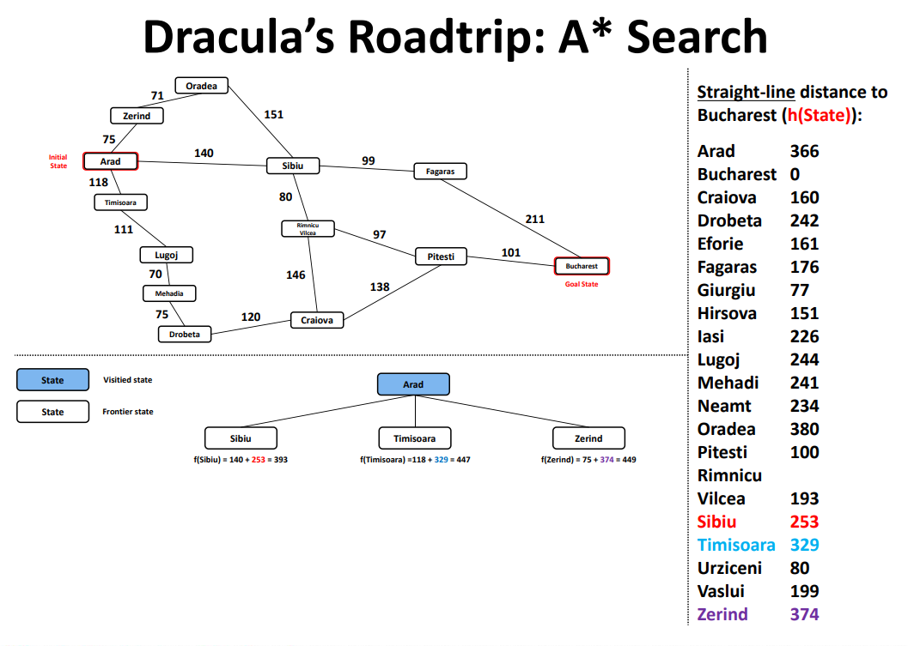

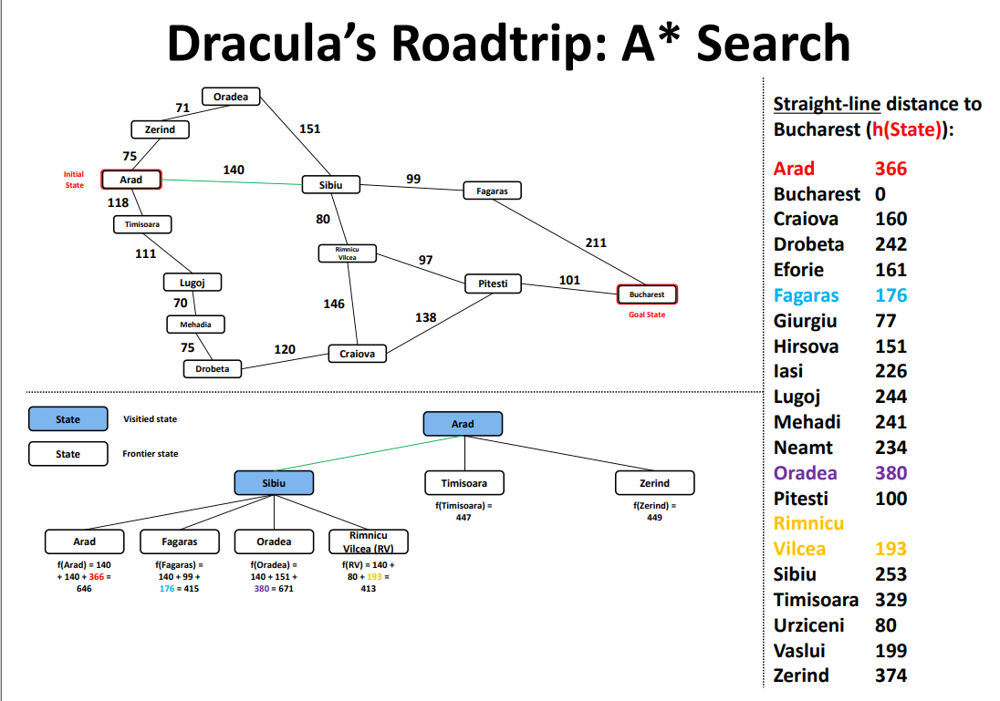

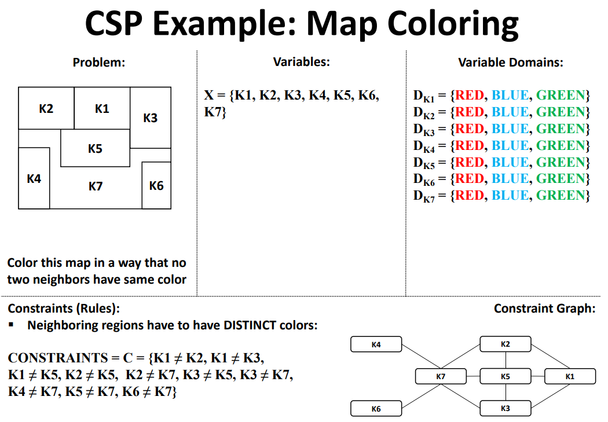

```
Propositional Logic: Laws/Theorems 命题逻辑：定律/定理


Interpretation 解释
Sentence: (p V q) ^ (-q V r)
Interpretation i: pi = true, qi = false


Evaluation

Propositional Logic: An Argument

Inference Rules: Modus Ponens

Argument Validity: Truth Table Proof

Logical Entailment 逻辑蕴涵
```


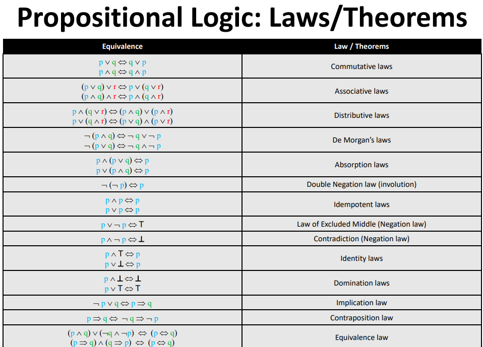

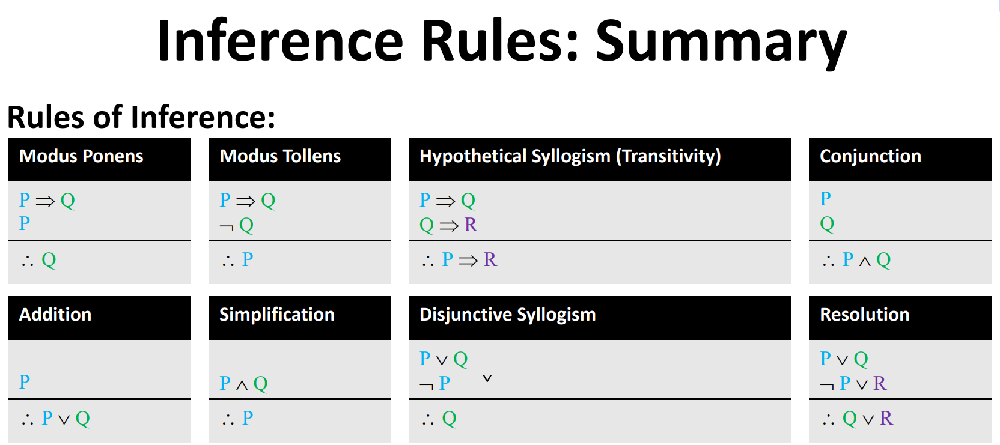

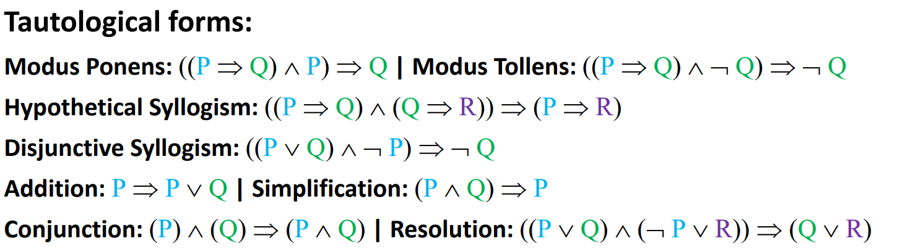

# RACKET


### Lists, Iteration, and Recursion


```python
> (map sqrt (list 1 4 9 16))
'(1 2 3 4)

> (map (lambda (i)
         (string-append i "!"))
       (list "peanuts" "popcorn" "crackerjack"))
'("peanuts!" "popcorn!" "crackerjack!")
```


# Software Engineering

```

== L2 Process Models==
Process Models
The drawback of the waterfall model is the difficulty of accommodating change after the process is underway.

Evolutionary development which is based upon the idea of developing an initial implementation , exposing it to the user and refining it based upon their response. 
Problems:Lack of process visibility; Systems are sometimes poorly structured

Agile development
Example include Scrum and XP


== L3 Software Specification===
The Requirements Engineering Process

Software Design and Implementation

Design Process Activities

The Testing Process
Unit testing
Individual components are tested
Module testing
Related collections of dependent components are tested
Sub-system testing (merges with system testing)
Modules are integrated into sub-systems and tested. The focus here should be on interface testing
System testing
Testing of the system as a whole. Testing of emergent properties
Acceptance testing
Testing with customer data to check that it is acceptable


== L4 Requirements Engineering===
Types of Requirement
User requirements
Statements in natural language plus diagrams of the services the system provides and its operational constraints. Written for customers
System requirements
A structured document setting out detailed descriptions of the system services. Written as a contract between client and contractor
Software specification
A detailed software description which can serve as a basis for a design or implementation. Written for developers


Functional and Non-Functional Requirements


== L7 System Models===
Data processing model - showing how the data is processed at different stages

Composition model - showing how entities are composed of other entities

Architectural model - showing principal sub-systems

Classification model - showing how entities have common characteristics

Stimulus/response model - showing the system’s reaction to events


Data Flow Diagrams
Statechart Diagrams
Finite State Machines

== L8 
Finite State Machines
Moore Machine
Mealy Machine
Petri Net Models

Semantic Data Models
Data Dictionary Entries


The Unified Modeling Language
Use-case diagrams
Class diagrams
Sequence diagrams
Statechart diagrams
Deployment diagrams

== L9 
High-Level Petri Nets

== L11 ormal Specification - Techniques for the Unambiguous Specification of Software
Formal specification
Specification analysis and proof
Transformational development
Program verification


== L12 Behavioural Specification
Algebraic specification can be cumbersome when the object operations are not independent of the object state

Model-based specification exposes the system state and defines the operations in terms of changes to that state
Abstract State Machine Language (AsmL)

== L13 Software Design 
Architectural design: Identify sub-systems.
Abstract specification: Specify sub-systems.
Interface design: Describe sub-system interfaces.
Component design: Decompose sub-systems into components.
Data structure design: Design data structures to hold problem data.
Algorithm design: Design algorithms for problem functions.


== L14 Module Interfaces
coupling, cohesion and interfaces 

== L15 Architectural Design 
Architectural Models


== L16 Distributed Systems
Multiprocessor Architectures
Client-Server Architectures
Layered Application Architecture

== L17 Object-Oriented


== L18 UML

== L19 Class Models

== L20 Aggregation and Composition

== L21 Use Case Diagram Collaboration Diagrams 

== L22 Verification and Validation
Verification should check the program meets its specification as written in the requirements document for example.
This may involve checking that it meets it functional and non-functional requirements.
Validation ensures that the product meets the customers expectations
This goes beyond checking it meets its specification; as we have seen, system specifications don’t always accurately reflect the real needs of users

== L22 Testing

Defect testing
Tests designed to discover system defects.
A successful defect test is one which reveals the presence of defects in a system.

Statistical testing
Tests designed to reflect the frequency of user inputs. Used for reliability estimation.

== L23 The Testing Process

== L24 Cyclomatic Complexity


== L25 Software Project Management

== L26 Software Cost Estimation
Expert Judgement
Estimation by Analogy
Parkinson's Law
Pricing to Win
Top-Down and Bottom-Up Estimation
Experience-Based Estimates
```


