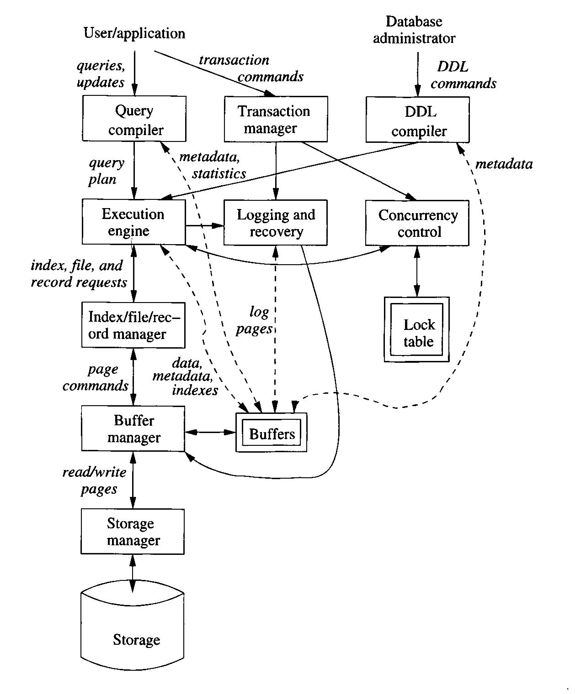

# Database Systems

What is a database?

*class answers/thoughts*

- System for storing and retrieving information effectievely 
- A unit of storage that holds information in an organized, easy-to-access manner
- a structured store of data

A DBMS (Database Management System) should:
1. Allow users to create new databases and specify their *schemas* (the logical structure of the data) using a specialized *Data Definition Language.*
2. Give users the ability to query the data and modify the data  using a query language or *Data Manipulation Language*
3. Support the storage of very large amounts of data, over a long period of time, allowing efficient access to the data for queries and database modification. 
4. Enable durability, the recovery of the database in the face of failures, errors of many kinds, or intentional misuse. 
5. Control access to data from many users at once, without allowing unexpected interaction among users (isolation), and without actions on the data being performed partially but not completely (atomicity). 

## Brief History of Databases

First commercial databases appeared in the late 1960's. They evolved from filesystems.

Filesystems have some shortcomings:
1 is supported only by creating files within the directory structure.
2 is not supported
3 is partially supported
4 is supported only through filesystem backups (maybe RAID to an extent)
5 not supported

Early applications of database systems were ones where data was composed of many small items that were frequently updated or modified. 

Examples:
- Airlines 
- Banks
- Corporations (HR, Inventory, Sales)

Early database systems required users to visualize the data more or less as it stored. 

Several data models existed, but common ones were
- Hierarchical: tree structure 
- Graph-based: network structure 

Did not support higher level query language. Programs were complex to write, even for simple queries. 

### Relational Model

1970, EF Codd published a paper describing Relational Data Model. 

Presented the data as a series of tables, called Relations.

Under the hood, the data could actually be stored in a much more complex data structure, that allowed for rapid responses to queries. But the database developer didn't need to be concerned with the underlying structure. 

Queries could be expressed in a higher-level language, meaning that database programmers were much more efficient. 

By the 1980's, relational database were the norm.

Since then, there's a deviation in scale:
- Smaller systems: a DBMS no longer requires a massive mainframe system. The software can be run on very small systems. 
    - Semi-structured approaches like XML allow for storing large amounts of data in collections of small documents. 
- Bigger Data: amount of data stored in modern systems is huge (petabytes and exobytes)
    - Newer database techniques have been developed to handle queries on datasets of this scale. 
    
Today, the problem is one of *information integration*: the data may be widely distributed across a number of separate databases and needs to be joined. 
Approaches for that:
- Data warehouses: data from different sources is copied periodically, with translation, into a single central database. 
- Middleware: software to support translation between different data sources into a single, unified data model. 

## Overview of a DBMS



Two basic use-cases:
- Users (application code) that ask for data or modify it
- Database administrators who are responsible for the structure of the data

The second type is easier to process:

Commands are parsed by a DDL compiler, passed to an execution engine, index/file/record manager alters the appropriate metadata. 

### Query processing overview

Data manipulation language handled by two subsystems:
- Answer the query:
    - Query compiler processes and parses/optimizes it
    - Execution engine executes the query plan
        - Requests data from the resource manager, which uses index files to find the correct data files. 
        - Requests for data go to the Buffer Manager
        - Buffer manager communicates with the Storage Manager
- Transaction processing: queries and other DML actions are grouped into *transactions*: units that must be executed atomically and in isolation from each other. 
    - Transactions must also be durable: their effect must be preserved even if there's a system failure
    - Transaction processor has two major parts
        - Concurrency-control Manager/Scheduler, which assures atomicity and isolation 
        - Logging and Recovery Manager, ensures durability

**Storage and Buffer Management**
Data is usually stored in "secondary storage" (disk). 
Operations are done on data in memory, for performance reasons

The *storage manager* controls the placement of the data on disk and its movement to and from main memory. 
In simple cases, this might be handled by the OS. Most DBMS do that work themselves. 

The *buffer manager* is responsible for partitioning main memory into Buffers: page sized regions to which disk blocks can be transferred. 

All the DBMS components that need to interact with data will do so with the data in buffers. That data may include:
- Data itself 
- Metadata: structure of, and constraints on, the data
- Log records: information about changes to the data
- Statistics: information gathered and stored about data properties: sizes and values or relations and other components. 
- Indexes: data structures that support efficient access to the data. 

*Transaction Processing**

Database operations are grouped into *Transactions*. Transaction commands are handled by the Transaction Manager.

The Transaction Manager performs the following tasks:
- Logging: ensures durability (recovery after a crash)
    - A log manager follows a policy designed to facilitate recovery. 
    - A recovery manager can examine the logs to restore the database to a consistent state. 
        - A log manager works with the Buffer Manager 
- Concurrency Control: the transactions must appear to execute in isolation from each other. Most systems have many transactions executing at once.
    - the *scheduler* assures that actions are executed in such a way that isolation appears to be in effect. Typically uses a system of locks. 
- Deadlock resolution: the transaction manager must also resolve deadlocks that occur when multiple transactions need access to the same resources. 

**Query Processor**

The query processor has two main components:
1. Query Compiler, which translates the query into a "query plan." 
    - A *query parser* builds a tree struture from the textual form of the query
    - a *query preprocessor* performs semantic checks on the query, and turns the parse tree into a tree of algebraic operators representing an initial query plan.
    - The *query optimizer* transforms the initial plan into the best available sequence of operations on actual data. 
2. Execution Engine is responsible for executing the steps in the query plan. It interacts with other database components as necessary. 

# Data Models

A data model is a notation for describing data or information.

There are generally three parts to a data model:
1. The Structure of the data: different from the data structures of programming languages. Those are sometimes called the Physical Data Model. This is the Conceptual Model. 
2. Operations on the data: queries/modifications.
    - Limits what can be done
    - Allows for efficiency
3. Constraints on Data

Important Data Models: Two general approaches:
1. Relational Model, including object-oriented extensions
2. Semi-structured Data Model: XML, JSON, etc. 

A good data model:
- Provides a simple, limited approach to structuring data, yet is reasonably versatile, allowing anything to be modeled. 
- Provides a limited yet useful collection of operations on the data

These limitations become features. A simple data model is easy to understand and reason about. Allows for query languages that can express powerful queries simply, while still being optimized. 

## Basics of the Relational Model

Provides a single way to represent data: a two-dimensional table called a *Relation*. 

The columns of the relation are called *Attributes*.

An attribute usually describes the meaning of the data in the column. 

The name of the relation and the set of its attributes are called its *Schema*. 

Attributes are a set, not a list. We usually define some standardized order.

We denote a schema with `name(attributes)`

``` 
Course(name, semester, location, time, capacity)
```

In the relational model, a database consists of one or more relations. The set of schemas is called a relational database schema, or just database schema. 

The rows of a relation are called *tuples*. 

```
(Database Systems, F20, Remote, W4-7, 25)
(Database Systems, F18, Low3039, W6-9, 25)
(Database Systems, F17, Low3039, W6-9, 25)
(Business Issues, S19, Pittsburgh2022, T10-12, 50)
```

Relational model requires that each component of a tuple be atomic. 

Each attribute has an associated domain

`course(name:string, semester:string, capacity:int)`

Relations are sets of tuples, not lists: order doesn't matter.

Relations are not static: they change over time. The set of tuples for a given relation at a given time is called a *relation instance*.

Usually we keep only one relation instance for each relation: current instance. 

Schemas may also change, but in practice that's very expensive. 

### Keys of Relations 

There are many types of constraints that may be placed on the data in relations. Most will be discussed later.

Key constraints are fundamental.

A set of attributes forms a key for a relation if we do not allow two tuples to have the same values for all attributes in the key.

Example: keys for course:

```
course(name, semester, location, time, capacity)
```

*class suggestions*
- Location, Time, semester
- name, semester
- name, time, semester

We indicate the key by underlining the attributes of the key

course(_name_, _semester_, location, time, capacity)

We can specify a *primary key* for a relation, but it only matters for implementations of the model. 

Remember that a key is a statement about all possible instances of a relation, not just descriptive of the current instance. 

```
(Database Systems, F17, Low3039, W6-9, 25)
(Business Issues, S19, Pittsburgh2022, T10-12, 50)
```

(Time and location appear to be a key, but that's only true for this instance, not all possible instances)

Artificial keys are often used. 

## Defining relations in SQL

SQL: Structured Query Language

Two main aspects:
- Data Definition Language: for declaring schemas
- Data Manipulation Language: for querying and modifying data

Main language used to define and manipulate databases.

Latest SQL Version is SQL 2016. The textbook uses SQL 1999.

Most commercial DBMS vendors implement something similar to, but not exactly the same as, the SQL standard. 

We'll use Postgres. There are many others:
- Oracle
- MySQL (MariaDB)
- SQL Server
- DB2
- SQLite 

### Relations in SQL

3 types of relations in SQL
- Stored Relations, called Tables
    - Exist in the database 
    - Have tuples
    - Can be queried or modified
- Views: relations defined by computations 
    - Not stored, constructed on demand
- Temporary Tables: constructed by the SQL language processor when executing queries. 
    - Discarded when done
    
We'll start with the DDL portion of SQL, specifically how to declare tables.

`CREATE TABLE` is the basic command to create a stored relation

Defines the attributes and their types

Can also define constraints, indexes, etc. 

### SQL Datatypes

- Character strings, of fixed or varying length
    - `CHAR(n)` (blank padded)
    - `VARCHAR(n)` note that SQL uses single quotes: `'my string'` not `"my string"`
    - Postgres also has `TEXT`
- Bit strings of fixed or varying length
    - `BIT(n)`
    - `BIT VARYING(n)`
- Boolean
    - `BOOLEAN`
        - `TRUE`, `FALSE`, `UNKNOWN`
- Integer
    - `INT` `INTEGER`
    - `LONG` `LONG INT` `BIG INT`
    - `SHORT INT`
- Floating Point
    - `FLOAT`
    - `DOUBLE` `DOUBLE PRECISION`
    - `REAL`
- Decimal
    - `DECIMAL(n, m)` decimal value of n digits, m after the `.`
    - `NUMERIC(n, m)`
- Dates and Times
    - `DATE` `DATE'YYYY-MM-DD'`
    - `TIME` `TIME'HH-MM-SS.sss'`
    - `DATETIME`
    - `TIMESTAMP` 
    - `INTERVAL'qty unit'` `INTERVAL'3 day'`
    - Dates and times may be cast to strings
    - Strings, if properly formatted, may be coerced into dates and times
    - Dates and times are incredibly complex. Refer to the implementation-specific documentation
    
Lots of other types: `BLOB`, `BYTEA`, `XML`, `JSON`, etc. 

`CREATE TABLE name(attributes)`

```postgresql
CREATE TABLE course(
    name VARCHAR(127),
    semester CHAR(3),
    location VARCHAR(127),
    time VARCHAR(63),
    capacity INT 
);


```

Modifying schemas:

`DROP TABLE r`

`ALTER TABLE r ADD attribute_name type`

`ALTER TABLE r DROP attribute_name`


```postgresql
ALTER TABLE course ADD registered INT;

ALTER TABLE course DROP registered;
```

### Default Values

When we create tuples or modify them, we might not have values for all attributes. If we don't specify a value, the database fills in `NULL`. We might not want that, so we can specify a default value to use instead.

```postgresql
ALTER TABLE course ALTER COLUMN time SET DEFAULT 'TBD';

CREATE TABLE student(
    name VARCHAR(255),
    email VARCHAR(31) DEFAULT 'no-reply@rpi.edu',
    major CHAR(4)
);
```

### Declaring Keys
There are two ways to declare a key:
- Declare one attribute to be the key when we define it.
- Add to the list of items defined in the schema, a declaration with a specific set of attributes

If a key has more than one attribute, we have to use the second option. 

There are two declarations we can use:

`PRIMARY KEY(attributes)`

`UNIQUE(attributes)`

If we use Primary Key, the DBMS won't allow NULL values in any of the attributes of the key. 


```postgresql
CREATE TABLE student(
    name VARCHAR(255),
    email VARCHAR(31) PRIMARY KEY DEFAULT 'no-reply@rpi.edu',
    major CHAR(4)
);

CREATE TABLE course(
    name VARCHAR(127),
    semester CHAR(3),
    location VARCHAR(127),
    time VARCHAR(63),
    capacity INT,
    PRIMARY KEY (name, semester),
    UNIQUE (location, time, semester)
);
```

Note that Postgres doesn't consider two NULL values to be equal for the purposes of the constraint
